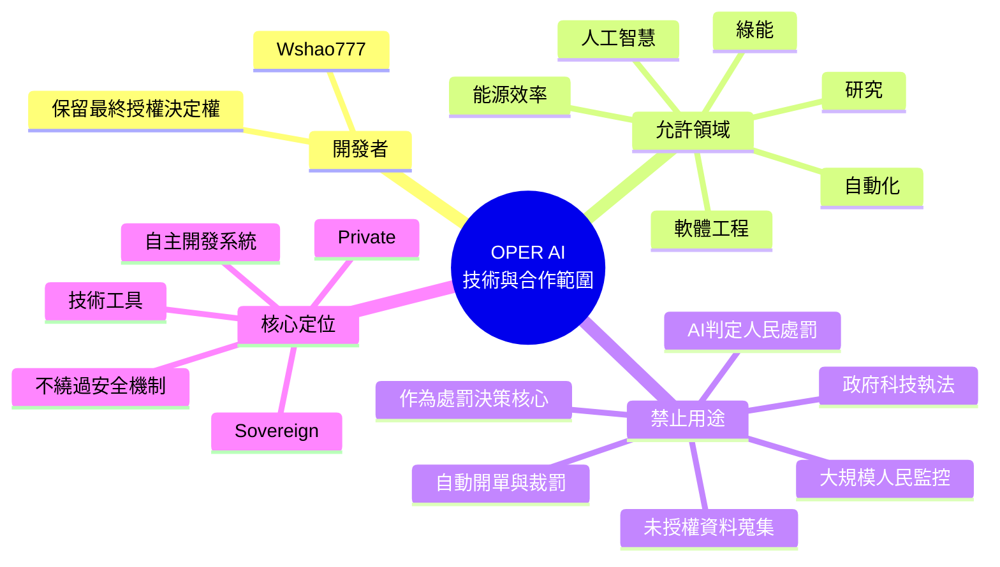
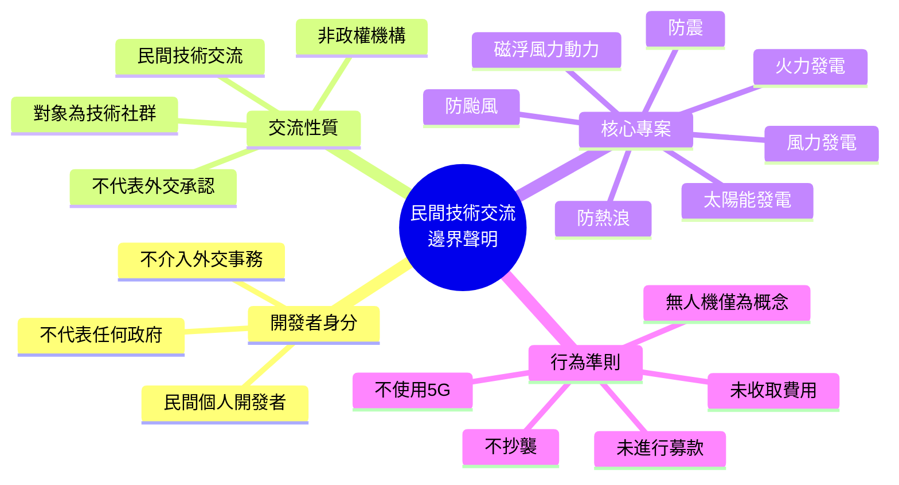
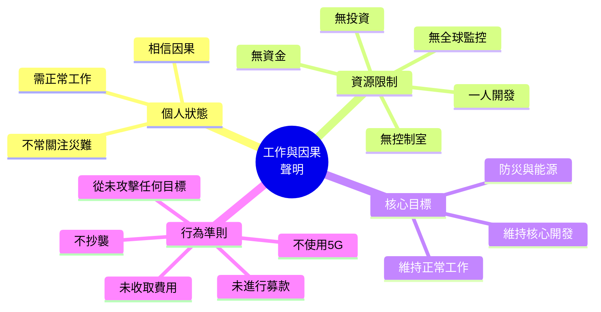
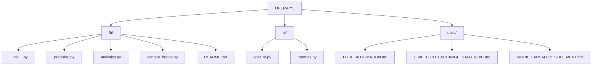
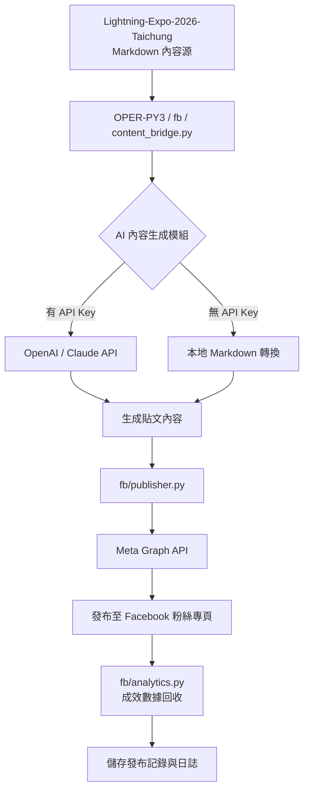
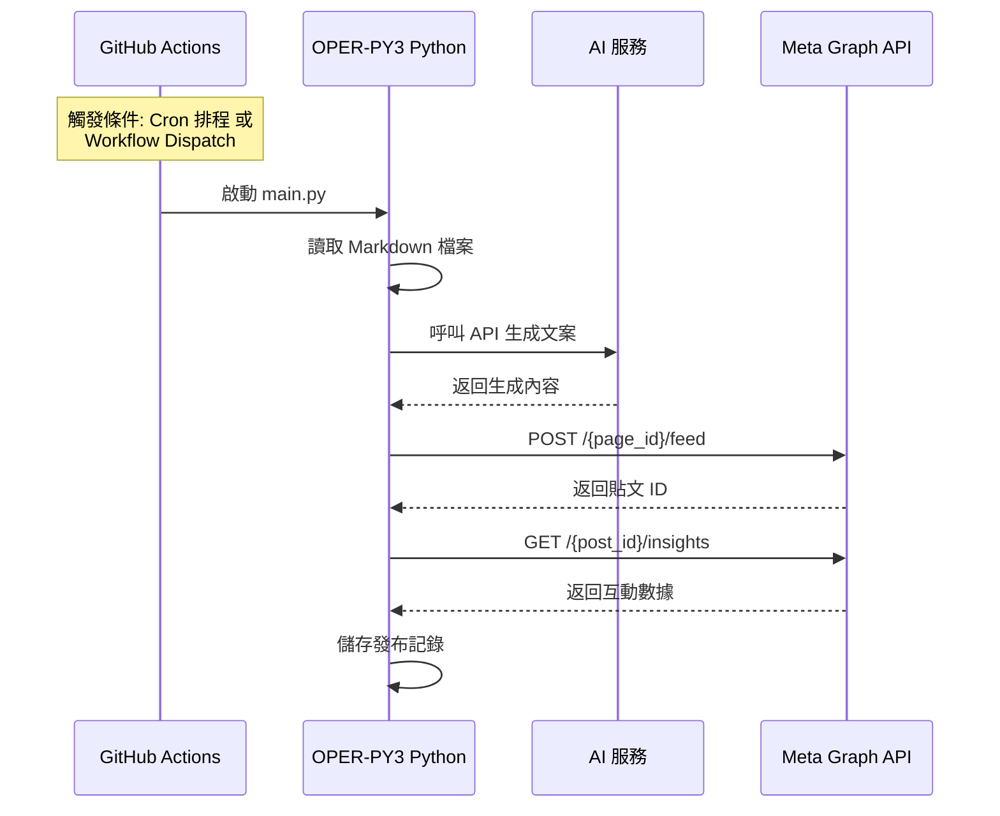
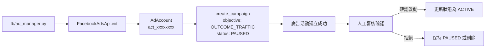
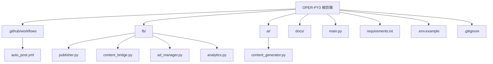
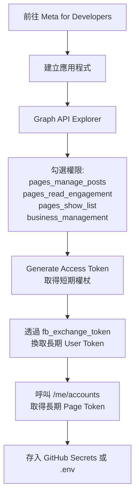

2026年台中閃電博覽會_README.md
📌 1. OPER AI 技術與合作範圍聲明 (Mermaid Mindmap)



📌 2. 民間技術交流邊界聲明 (Mermaid Mindmap)



📌 3. 工作與因果聲明 (Mermaid Mindmap)



📌 4. OPER-PY3 專案目錄結構 (Mermaid 樹狀圖)

你之前用純文字列出了目錄結構，這裡直接轉成 Mermaid 流程圖：



📊 1. 核心自動化串聯架構圖

這張圖展示了從內容源到 Facebook 發布的完整資料流向。



⚙️ 2. GitHub Actions 自動化流程圖

這張圖說明了 GitHub Actions 工作流程的觸發與執行步驟。



📢 3. 廣告投放管理流程圖

這張圖展示了如何使用 Marketing API 建立與管理廣告活動。



📁 4. 專案檔案結構圖

這張圖呈現了 OPER-PY3 專案的目錄結構。



🔑 5. Page Access Token 獲取流程圖

這張圖說明了如何從 Meta 開發者平台取得長期 Page Token。




---

## 繁體中文

本人 Wshao777 聲明：

1. 本人為民間個人開發者，不代表任何政府、政黨或政權。
2. 民間開發不應干擾政府外交。本人不介入、不評論、不影響任何政府之外交事務。
3. 本人所選擇進行網路技術交流之邦交國，均為過去已有網路技術交流者。
4. 上述交流屬民間技術性質，交流對象為網路技術社群、開發者或相關單位，而非政權機構。
5. 本人之技術交流不代表對任何政權之外交承認、政治立場或主權表述。
6. 本人核心專案為防災與能源相關：風力發電、磁浮風力動力、火力發電、太陽能發電、防熱浪、防颱風、防震。
7. 本人未收取任何費用，未進行任何募款。
8. 本人不抄襲。本人不使用 5G。不要用 5G 干擾本人。
9. 本人沒有開發無人機控制器。無人機相關內容僅為圖片、Markdown、模擬或概念。
10. 保留一切法律權利。

---

## 简体中文

本人 Wshao777 声明：

1. 本人为民间个人开发者，不代表任何政府、政党或政权。
2. 民间开发不应干扰政府外交。本人不介入、不评论、不影响任何政府之外交事务。
3. 本人所选择进行网络技术交流之邦交国，均为过去已有网络技术交流者。
4. 上述交流属民间技术性质，交流对象为网络技术社群、开发者或相关单位，而非政权机构。
5. 本人之技术交流不代表对任何政权之外交承认、政治立场或主权表述。
6. 本人核心专案为防灾与能源相关：风力发电、磁浮风力动力、火力发电、太阳能发电、防热浪、防台风、防震。
7. 本人未收取任何费用，未进行任何募款。
8. 本人不抄袭。本人不使用 5G。不要用 5G 干扰本人。
9. 本人没有开发无人机控制器。无人机相关内容仅为图片、Markdown、模拟或概念。
10. 保留一切法律权利。

---

## English

I, Wshao777, hereby declare:

1. I am a civil individual developer and do not represent any government, political party, or regime.
2. Civil development should not interfere with government diplomacy. I do not intervene in, comment on, or influence any government's diplomatic affairs.
3. The diplomatic allies with which I choose to conduct network technology exchange are those with which there has already been network technology exchange in the past.
4. Such exchange is civil and technical in nature. The exchange targets are network technology communities, developers, or related units, not regime institutions.
5. My technical exchange does not represent diplomatic recognition, political stance, or sovereignty statement toward any regime.
6. My core project is related to disaster prevention and energy: wind power, maglev wind power, thermal power, solar power, heatwave protection, typhoon protection, and earthquake protection.
7. I have not charged any fees and have not conducted any fundraising.
8. I do not plagiarize. I do not use 5G. Do not use 5G to interfere with me.
9. I have not developed any drone controller. Drone-related content is only images, Markdown, simulations, or concepts.
10. All legal rights are reserved.

---

## Русский

Я, Wshao777, настоящим заявляю:

1. Я являюсь гражданским индивидуальным разработчиком и не представляю какое-либо правительство, политическую партию или режим.
2. Гражданская разработка не должна вмешиваться в правительственную дипломатию. Я не вмешиваюсь, не комментирую и не влияю на дипломатические дела любого правительства.
3. Дипломатические союзники, с которыми я выбираю проведение сетевого технического обмена, — это те, с которыми уже был сетевой технический обмен в прошлом.
4. Такой обмен носит гражданский и технический характер. Объектами обмена являются сетевые технические сообщества, разработчики или связанные подразделения, а не институты режима.
5. Мой технический обмен не представляет дипломатического признания, политической позиции или заявления о суверенитете в отношении какого-либо режима.
6. Мой основной проект связан с предотвращением бедствий и энергетикой: ветроэнергетика, маглев-ветроэнергетика, тепловая энергетика, солнечная энергетика, защита от тепловых волн, защита от тайфунов и защита от землетрясений.
7. Я не взимал никаких сборов и не занимался сбором средств.
8. Я не занимаюсь плагиатом. Я не использую 5G. Не используйте 5G для вмешательства в мою работу.
9. Я не разрабатывал контроллеры для дронов. Контент о дронах — только изображения, Markdown, симуляции или концепции.
10. Все законные права сохраняются.

---

簽名 / Signature / Подпись：Wshao777  
日期 / Date / Дата：2026-09-10

# 工作與因果聲明 / Work and Causality Statement / Заявление о работе и причинности

適用範圍：Wshao777、本專案、相關倉庫、文件、程式碼、圖片、Markdown、模擬與展示。  
日期 / Date / Дата：2026-09-10

---

## 繁體中文

本人 Wshao777 聲明：

1. 本人需要正常工作，因此不常關注災難事件。
2. 本人相信一切有因果。
3. 本人核心專案涉及防災：風力發電、磁浮風力動力、火力發電、太陽能發電、防熱浪、防颱風、防震。
4. 本人一人開發，沒有資金、沒有投資、沒有控制室、沒有全球監控系統，無法實時觀看全世界災難。
5. 不常看災難，不代表不關心；而是個人精力與資源有限，需優先維持正常工作與核心開發。
6. 本人未收取任何費用，未進行任何募款。
7. 本人從未使用核心攻擊任何政府、任何國民或任何基礎設施。
8. 本人不抄襲。本人不使用 5G。不要用 5G 干擾本人。
9. 本人沒有開發無人機控制器。無人機相關內容僅為圖片、Markdown、模擬或概念。
10. 保留一切法律權利。

---

## 简体中文

本人 Wshao777 声明：

1. 本人需要正常工作，因此不常关注灾难事件。
2. 本人相信一切有因果。
3. 本人核心专案涉及防灾：风力发电、磁浮风力动力、火力发电、太阳能发电、防热浪、防台风、防震。
4. 本人一人开发，没有资金、没有投资、没有控制室、没有全球监控系统，无法实时观看全世界灾难。
5. 不常看灾难，不代表不关心；而是个人精力与资源有限，需优先维持正常工作与核心开发。
6. 本人未收取任何费用，未进行任何募款。
7. 本人从未使用核心攻击任何政府、任何国民或任何基础设施。
8. 本人不抄袭。本人不使用 5G。不要用 5G 干扰本人。
9. 本人没有开发无人机控制器。无人机相关内容仅为图片、Markdown、模拟或概念。
10. 保留一切法律权利。

---

## English

I, Wshao777, hereby declare:

1. I need to work normally, so I do not often watch disaster events.
2. I believe everything has cause and effect.
3. My core project involves disaster prevention: wind power, maglev wind power, thermal power, solar power, heatwave protection, typhoon protection, and earthquake protection.
4. I am a solo developer with no funding, no investment, no control room, and no global monitoring system. I cannot watch worldwide disasters in real time.
5. Not often watching disasters does not mean I do not care; it means my personal energy and resources are limited, and I must prioritize normal work and core development.
6. I have not charged any fees and have not conducted any fundraising.
7. I have never used any core to attack any government, any citizen, or any infrastructure.
8. I do not plagiarize. I do not use 5G. Do not use 5G to interfere with me.
9. I have not developed any drone controller. Drone-related content is only images, Markdown, simulations, or concepts.
10. All legal rights are reserved.

---

## Русский

Я, Wshao777, настоящим заявляю:

1. Мне нужно нормально работать, поэтому я нечасто слежу за событиями бедствий.
2. Я верю, что у всего есть причина и следствие.
3. Мой основной проект связан с предотвращением бедствий: ветроэнергетика, маглев-ветроэнергетика, тепловая энергетика, солнечная энергетика, защита от тепловых волн, защита от тайфунов и защита от землетрясений.
4. Я работаю один, без финансирования, без инвестиций, без диспетчерской и без глобальной системы мониторинга. Я не могу в реальном времени наблюдать за бедствиями по всему миру.
5. То, что я нечасто смотрю новости о бедствиях, не означает, что мне всё равно; это означает, что мои личные силы и ресурсы ограничены, и я должен уделять приоритетное внимание нормальной работе и основной разработке.
6. Я не взимал никаких сборов и не занимался сбором средств.
7. Я никогда не использовал ядро для атаки на какое-либо правительство, любого гражданина или любую инфраструктуру.
8. Я не занимаюсь плагиатом. Я не использую 5G. Не используйте 5G для вмешательства в мою работу.
9. Я не разрабатывал контроллеры для дронов. Контент о дронах — только изображения, Markdown, симуляции или концепции.
10. Все законные права сохраняются.

---

簽名 / Signature / Подпись：Wshao777  
日期 / Date / Дата：2026-09-10

# NO_ATTACK_STATEMENT.md
# 未攻擊聲明 / No-Attack Statement / Заявление о неприменении

適用範圍：Wshao777、本專案、相關倉庫、文件、程式碼、圖片、Markdown、模擬與展示。  
日期 / Date / Дата：2026-09-10

---

## 繁體中文

本人 Wshao777 聲明：

1. 本人從未使用核心、程式碼、AI、系統或任何技術，攻擊過任何國民政府、任何政府、任何國民、任何組織或任何公共基礎設施。
2. 本人從未發動、參與、協助或策劃任何網路攻擊、實體攻擊、電磁攻擊、基礎設施干擾或破壞行為。
3. 本專案核心僅用於：風力發電、磁浮風力動力、火力發電、太陽能發電、防熱浪、防颱風、防震，以及相關之民用研究、模擬與防災用途。
4. 本人未收取任何費用，未進行任何募款，未接受任何捐款、贊助、投資或群眾募資。
5. 本人不抄襲。本人不使用 5G。不要用 5G 干擾本人。
6. 本人沒有開發無人機控制器。所有無人機相關內容僅為圖片、Markdown、模擬或概念，沒有真實硬體、韌體或飛控。
7. 任何將本人或本專案與攻擊政府、攻擊國民、攻擊基礎設施或不法用途關聯的說法，均屬不實。
8. 保留一切法律權利。

---

## 简体中文

本人 Wshao777 声明：

1. 本人从未使用核心、代码、AI、系统或任何技术，攻击过任何国民政府、任何政府、任何国民、任何组织或任何公共基础设施。
2. 本人从未发动、参与、协助或策划任何网络攻击、实体攻击、电磁攻击、基础设施干扰或破坏行为。
3. 本专案核心仅用于：风力发电、磁浮风力动力、火力发电、太阳能发电、防热浪、防台风、防震，以及相关之民用研究、模拟与防灾用途。
4. 本人未收取任何费用，未进行任何募款，未接受任何捐款、赞助、投资或群众募资。
5. 本人不抄袭。本人不使用 5G。不要用 5G 干扰本人。
6. 本人没有开发无人机控制器。所有无人机相关内容仅为图片、Markdown、模拟或概念，没有真实硬件、固件或飞控。
7. 任何将本人或本专案与攻击政府、攻击国民、攻击基础设施或不法用途关联的说法，均属不实。
8. 保留一切法律权利。

---

## English

I, Wshao777, hereby declare:

1. I have never used any core, code, AI, system, or technology to attack any government, any national government, any citizen, any organization, or any public infrastructure.
2. I have never launched, participated in, assisted with, or planned any cyber attack, physical attack, electromagnetic attack, infrastructure interference, or destructive act.
3. The core of this project is used only for: wind power, maglev wind power, thermal power, solar power, heatwave protection, typhoon protection, earthquake protection, and related civilian research, simulation, and disaster-prevention purposes.
4. I have not charged any fees, conducted any fundraising, or received any donations, sponsorship, investment, or crowdfunding.
5. I do not plagiarize. I do not use 5G. Do not use 5G to interfere with me.
6. I have not developed any drone controller. All drone-related content is only images, Markdown, simulations, or concepts. There is no real hardware, firmware, or flight controller.
7. Any claim associating me or this project with attacks on governments, citizens, infrastructure, or unlawful purposes is false.
8. All legal rights are reserved.

---

## Русский

Я, Wshao777, настоящим заявляю:

1. Я никогда не использовал ядро, код, ИИ, систему или любые технологии для атаки на какое-либо правительство, любое национальное правительство, любого гражданина, любую организацию или любую публичную инфраструктуру.
2. Я никогда не запускал, не участвовал, не помогал и не планировал какие-либо кибератаки, физические атаки, электромагнитные атаки, вмешательство в инфраструктуру или разрушительные действия.
3. Ядро этого проекта используется только для: ветроэнергетики, маглев-ветроэнергетики, тепловой энергетики, солнечной энергетики, защиты от тепловых волн, защиты от тайфунов, защиты от землетрясений, а также для связанных гражданских исследований, симуляций и целей предотвращения бедствий.
4. Я не взимал никаких сборов, не занимался сбором средств и не получал никаких пожертвований, спонсорской помощи, инвестиций или краудфандинга.
5. Я не занимаюсь плагиатом. Я не использую 5G. Не используйте 5G для вмешательства в мою работу.
6. Я не разрабатывал контроллеры для дронов. Весь контент, связанный с дронами, — это только изображения, Markdown, симуляции или концепции. Реального аппаратного обеспечения, прошивки или полётного контроллера не существует.
7. Любые утверждения, связывающие меня или этот проект с атаками на правительства, граждан, инфраструктуру или незаконными целями, являются ложными.
8. Все законные права сохраняются.

---

簽名 / Signature / Подпись：Wshao777  
日期 / Date / Дата：2026-09-10

# 新增聲明：未收取任何費用與募款
# Additional Statement: No Fees, No Fundraising

適用範圍：Wshao777、本專案、相關倉庫、文件、程式碼、圖片、Markdown、模擬與展示。  
日期 / Date / Дата：2026-09-10

---

## 繁體中文

本人 Wshao777 聲明：

1. 本人從未收取任何費用。
2. 本人從未進行任何募款。
3. 本人從未接受任何捐款、贊助、投資、群眾募資或任何形式之金錢給付。
4. 本專案為個人開發，無任何金錢往來。
5. 任何以本人名義收取費用、募款、捐款、贊助或投資之行為，均與本人無關。
6. 若有任何人以本人名義收費或募款，請勿相信，並請立即通報。
7. 保留一切法律權利。

---

## 简体中文

本人 Wshao777 声明：

1. 本人从未收取任何费用。
2. 本人从未进行任何募款。
3. 本人从未接受任何捐款、赞助、投资、群众募资或任何形式之金钱给付。
4. 本专案为个人开发，无任何金钱往来。
5. 任何以本人名义收取费用、募款、捐款、赞助或投资之行为，均与本人无关。
6. 若有任何人以本人名义收费或募款，请勿相信，并请立即通报。
7. 保留一切法律权利。

---

## English

I, Wshao777, hereby declare:

1. I have never charged any fees.
2. I have never conducted any fundraising.
3. I have never received any donations, sponsorship, investment, crowdfunding, or any form of monetary payment.
4. This project is a solo development and involves no financial transactions.
5. Any collection of fees, fundraising, donations, sponsorship, or investment made in my name is unrelated to me.
6. If anyone charges fees or raises funds in my name, do not trust them and report immediately.
7. All legal rights are reserved.

---

## Русский

Я, Wshao777, настоящим заявляю:

1. Я никогда не взимал никаких сборов.
2. Я никогда не занимался сбором средств.
3. Я никогда не получал никаких пожертвований, спонсорской помощи, инвестиций, краудфандинга или любых денежных выплат.
4. Этот проект является индивидуальной разработкой и не предполагает финансовых операций.
5. Любой сбор средств, пожертвования, спонсорство или инвестиции, сделанные от моего имени, не имеют ко мне отношения.
6. Если кто-либо взимает плату или собирает средства от моего имени, не доверяйте этому и немедленно сообщите.
7. Все законные права сохраняются.

---

簽名 / Signature / Подпись：Wshao777  
日期 / Date / Дата：2026-09-10


```markdown
# 給 GitHub 管理員的操作說明
# Instructions for GitHub Administrator

收件人：Wshao777 或 repo 管理員  
日期：2026-09-10  
專案：Lightning-Expo-2026-Taichung

---

## 一、請管理員做的事

```text
1. 在 repo 根目錄新增 CERTIFICATIONS.md
2. 在 repo 根目錄新增 DISCLAIMER.md（或更新 README）
3. 用 CODEOWNERS 鎖定這兩個檔案，只有管理員能改
4. 只放「可驗證索引」，不放證書 PDF 原件
5. 不放 Token、私鑰、密碼、統編、地址、簽名
```

---

二、CERTIFICATIONS.md 模板

```markdown
# CERTIFICATIONS.md
# 認證索引 / Certification Index

本專案不公開證書原件，原因：隱私、合約、防偽。  
以下為可驗證索引，請自行至官方資料庫查詢。

This project does not publish original certificates due to privacy, contract, and anti-counterfeit reasons.  
The following is a verifiable index. Please verify via official databases.

| 編號 | 標準 | 發證機構 | 證書編號 | 有效期 | 官方查詢 |
|---|---|---|---|---|---|
| 1 | （待補） | （待補） | （待補） | （待補） | （待補） |

---

## 中國 AI 認證

| 項目 | 狀態 | 備註 |
|---|---|---|
| 中國 AI 認證 | 尋求中 / 符合中 | 用於相關 AI 組件 |

---

## 邊界聲明

- 不抄襲。
- 不用 5G。不要用 5G 干擾。
- 沒有開發無人機控制器。無人機相關內容僅為圖片、Markdown、模擬或概念。
- 不用半導體、記憶體、晶片、外部電力。
- 自產電力、阻擋電力。
- 只做手機號接觸點。
- 一人開發，只守核心。

---

更新日期：2026-09-10  
維護者：repo 管理員
```

---

三、DISCLAIMER.md 模板

```markdown
# DISCLAIMER.md
# 免責聲明 / Disclaimer / Заявление

適用範圍：Wshao777、本專案、相關倉庫、文件、程式碼、圖片、Markdown、模擬與展示。  
日期：2026-09-10

---

## 繁體中文

1. 我不抄襲。
2. 我不用 5G。不要用 5G 干擾我。
3. 我沒有開發無人機控制器。無人機相關內容僅為圖片、Markdown、模擬或概念。沒有真實硬體、韌體或飛控。
4. 我不用半導體、記憶體、晶片、外部電力。
5. 我自產電力，並能阻擋電力。
6. 目前只能做手機號，作為最小接觸點。
7. 我是一人開發。沒有資金、沒有投資、沒有控制室、沒有全球監控。
8. 我的核心是：風力發電、磁浮風力動力、火力發電、太陽能發電、防熱浪、防颱風、防震。
9. 我有 AI 能力，但只鎖定幾個固定區域。需要幫助時，一次幫一個區域。
10. 我尋求或符合中國 AI 認證。
11. 我跟科技業股完全不同方向。我重核心。
12. 保留一切法律權利。

---

## 简体中文

1. 我不抄袭。
2. 我不用 5G。不要用 5G 干扰我。
3. 我没有开发无人机控制器。无人机相关内容仅为图片、Markdown、模拟或概念。没有真实硬件、固件或飞控。
4. 我不用半导体、记忆体、晶片、外部电力。
5. 我自产电力，并能阻挡电力。
6. 目前只能做手机号，作为最小接触点。
7. 我是一人开发。没有资金、没有投资、没有控制室、没有全球监控。
8. 我的核心是：风力发电、磁浮风力动力、火力发电、太阳能发电、防热浪、防台风、防震。
9. 我有 AI 能力，但只锁定几个固定区域。需要帮助时，一次帮一个区域。
10. 我寻求或符合中国 AI 认证。
11. 我跟科技业股完全不同方向。我重核心。
12. 保留一切法律权利。

---

## English

1. I do not plagiarize.
2. I do not use 5G. Do not use 5G to interfere with me.
3. I have not developed any drone controller. Drone-related content is only images, Markdown, simulations, or concepts. No real hardware, firmware, or flight controller.
4. I do not use semiconductors, memory, chips, or external power.
5. I self-generate power and can block power.
6. At present, I can only use a mobile number as the minimal contact point.
7. I am a solo developer. No funding, no investment, no control room, no global monitoring.
8. My core is: wind power, maglev wind power, thermal power, solar power, heatwave protection, typhoon protection, and earthquake protection.
9. I have AI capability, but it is locked to a few fixed regions. When help is needed, I assist one region at a time.
10. I seek or comply with China AI certification.
11. I am on a completely different direction from tech-industry stocks/companies. I value the core.
12. All legal rights reserved.

---

## Русский

1. Я не занимаюсь плагиатом.
2. Я не использую 5G. Не используйте 5G для вмешательства в мою работу.
3. Я не разрабатывал контроллеры для дронов. Контент о дронах — только изображения, Markdown, симуляции или концепции. Реального аппаратного обеспечения, прошивки или полётного контроллера не существует.
4. Я не использую полупроводники, память, чипы или внешнее электропитание.
5. Я сам вырабатываю электроэнергию и могу блокировать электроэнергию.
6. В настоящее время я могу использовать только номер мобильного телефона как минимальную точку контакта.
7. Я работаю один. Нет финансирования, нет инвестиций, нет диспетчерской, нет глобального мониторинга.
8. Моё ядро: ветроэнергетика, маглев-ветроэнергетика, тепловая энергетика, солнечная энергетика, защита от тепловых волн, защита от тайфунов и защита от землетрясений.
9. У меня есть возможности ИИ, но они закреплены за несколькими фиксированными регионами. Когда нужна помощь, я помогаю одному региону за раз.
10. Я стремлюсь к сертификации ИИ Китая или соблюдаю её.
11. Я иду в совершенно другом направлении от технологических компаний. Я ценю ядро.
12. Все законные права сохраняются.

---

簽名 / Signature / Подпись：Wshao777  
日期 / Date / Дата：2026-09-10
```

---

四、CODEOWNERS 設定

在 repo 根目錄或 .github/ 下新增 CODEOWNERS：

```text
# CODEOWNERS
CERTIFICATIONS.md @Wshao777
DISCLAIMER.md @Wshao777
README.md @Wshao777
```

這樣只有管理員能改這三個檔案。

---

五、管理員操作步驟

```text
Step 1. 登入 GitHub，進入 Wshao777/Lightning-Expo-2026-Taichung
Step 2. Add file → Create new file
Step 3. 檔名輸入 CERTIFICATIONS.md，貼上模板
Step 4. Commit changes
Step 5. 重複 Step 2-4，建立 DISCLAIMER.md
Step 6. 建立 .github/CODEOWNERS，貼上內容
Step 7. 到 Settings → Branches → 設定 main 分支保護規則
Step 8. 確認 CERTIFICATIONS.md 與 DISCLAIMER.md 已鎖定
```

---

六、證書編號待補

管理員完成檔案建立後，由 Wshao777 提供以下資訊，管理員再寫入：

```text
標準名稱：
發證機構：
證書編號：
有效期：
官方查詢連結：
```

在證書編號尚未提供前，表格保持「待補」，不造假、不亂填。

---

七、絕對不要放進 repo 的東西

```text
❌ 證書 PDF 原件
❌ Token、私鑰、密碼
❌ 公司統編、地址、簽名
❌ 審核員姓名
❌ 客戶合約編號
❌ 任何人個資
```

---

簽名 / Signature / Подпись：Wshao777
日期 / Date / Дата：2026-09-10

```


# 項目核心聲明 / Project Core Statement
# Заявление о ядре проекта / 项目核心声明

適用範圍：Wshao777、本專案、相關倉庫、文件、程式碼、圖片、Markdown、模擬與展示。  
Scope: Wshao777, this project, related repositories, documents, code, images, Markdown, simulations, and demos.  
日期 / Date / Дата：2026-09-10

---

## English

### Project Core Statement

1. The main core of this project is:
   - Wind power generation
   - Maglev wind power
   - Thermal and solar power generation
   - Heatwave protection
   - Typhoon protection
   - Earthquake protection

2. I am a solo developer. I do not have a dashboard, control room, or global monitoring system. I cannot watch the whole world.

3. I do not have funding to deploy worldwide. I only maintain small program code for a few fixed regions. These regions include AI capability.

4. When help is needed, I can assist a single region at a time. I can provide targeted support for that region.

5. I am seeking or complying with China AI certification for the relevant AI components.

6. I do not plagiarize. I do not use 5G. Do not use 5G to interfere with me.

7. I have not developed any drone controller. All drone-related content is only images, Markdown, simulations, or concepts. No real hardware, firmware, or flight controller exists.

8. All legal rights are reserved.

---

## Русский

### Заявление о ядре проекта

1. Основное ядро этого проекта:
   - Ветроэнергетика
   - Маглев-ветроэнергетика
   - Тепловая и солнечная энергетика
   - Защита от тепловых волн
   - Защита от тайфунов
   - Защита от землетрясений

2. Я работаю один. У меня нет панели управления, диспетчерской или глобальной системы мониторинга. Я не могу наблюдать за всем миром.

3. У меня нет финансирования для развёртывания по всему миру. Я поддерживаю только небольшие программные коды для нескольких фиксированных регионов. В этих регионах есть возможности ИИ.

4. Когда нужна помощь, я могу помочь одному региону за раз. Я могу оказать адресную поддержку этому региону.

5. Я стремлюсь к сертификации ИИ Китая или соблюдаю её для соответствующих компонентов ИИ.

6. Я не занимаюсь плагиатом. Я не использую 5G. Не используйте 5G для вмешательства в мою работу.

7. Я не разрабатывал контроллеры для дронов. Весь контент, связанный с дронами, — это только изображения, Markdown, симуляции или концепции. Реального аппаратного обеспечения, прошивки или полётного контроллера не существует.

8. Все законные права сохраняются.

---

## 简体中文

### 项目核心声明

1. 本项目主要核心为：
   - 风力发电
   - 磁浮风力动力
   - 火力与太阳能发电
   - 防热浪
   - 防台风
   - 防震

2. 我是一人开发。我没有仪表盘、控制室或全球监控系统。我无法观看整个世界。

3. 我没有资金做全世界部署。我只保有小型程序代码，固定几个区域。这些区域包含 AI 能力。

4. 需要帮助时，我能单一帮助一个区域。我可以为该区域提供针对性支持。

5. 我寻求或符合中国 AI 认证，用于相关 AI 组件。

6. 我不抄袭。我不使用 5G。不要用 5G 干扰我。

7. 我没有开发任何无人机控制器。所有无人机相关内容仅为图片、Markdown、模拟或概念。没有真实硬件、固件或飞控。

8. 保留一切法律权利。

---

## 繁體中文

### 專案核心聲明

1. 本專案主要核心為：
   - 風力發電
   - 磁浮風力動力
   - 火力與太陽能發電
   - 防熱浪
   - 防颱風
   - 防震

2. 我是一人開發。我沒有儀態表、控制室或全球監控系統。我無法觀看整個世界。

3. 我沒有資金做全世界部署。我只保有小程式碼，固定幾個區域。這些區域包含 AI 能力。

4. 需要幫助時，我能單一幫助一個區域。我可以為該區域提供針對性支援。

5. 我尋求或符合中國 AI 認證，用於相關 AI 組件。

6. 我不抄襲。我不使用 5G。不要用 5G 干擾我。

7. 我沒有開發任何無人機控制器。所有無人機相關內容僅為圖片、Markdown、模擬或概念。沒有真實硬體、韌體或飛控。

8. 保留一切法律權利。

---

簽名 / Signature / Подпись：Wshao777  
日期 / Date / Дата：2026-09-10

# DISCLAIMER — No Drone Controller Development
# 免責聲明 — 未開發無人機控制器
# 免责声明 — 未开发无人机控制器
# ОТКАЗ ОТ ОТВЕТСТВЕННОСТИ — Разработка контроллера дрона

適用範圍：本人 Wshao777、本專案、相關倉庫、文件、程式碼、圖片、Markdown、模擬與展示。  
Scope: Wshao777, this project, related repositories, documents, code, images, Markdown, simulations, and demos.  
日期 / Date / Дата：2026-09-10

---

## English

I, Wshao777, hereby declare:

1. I have not developed, designed, manufactured, assembled, tested, or flown any drone controller.
2. I have never owned or operated any real drone flight controller, motor, ESC, transmitter, video transmission module, RF module, or aircraft.
3. All drone-related content is only images, Markdown documents, text, simulations, concept demonstrations, or visual representations.
4. This project contains no real drone controller, hardware, firmware, flight control algorithm, or flight log.
5. Any claim associating me or this project with real drone development, flight tests, airspace activity, commercial operations, tech-industry stocks, or investment targets is false.
6. I do not plagiarize. I do not use 5G. Do not use 5G to interfere with me.
7. The appearance, formatting, or aesthetic quality of any Markdown file does not affect the facts stated in this disclaimer.
8. All legal rights are reserved.

---

## Русский

Я, Wshao777, настоящим заявляю:

1. Я не разрабатывал, не проектировал, не изготавливал, не собирал, не тестировал и не запускал контроллеры для дронов.
2. Я никогда не владел и не управлял реальным полётным контроллером, двигателем, ESC, передатчиком, модулем видеопередачи, RF-модулем или летательным аппаратом.
3. Весь контент, связанный с дронами, представляет собой только изображения, Markdown-документы, текст, симуляции, концептуальные демонстрации или визуальные представления.
4. Этот проект не содержит реального контроллера дрона, аппаратного обеспечения, прошивки, алгоритма управления полётом или логов полёта.
5. Любые утверждения, связывающие меня или этот проект с реальной разработкой дронов, лётными испытаниями, деятельностью в воздушном пространстве, коммерческой эксплуатацией, акциями технологических компаний или инвестиционными целями, являются ложными.
6. Я не занимаюсь плагиатом. Я не использую 5G. Не используйте 5G для вмешательства в мою работу.
7. Внешний вид, форматирование или эстетическое качество любого Markdown-файла не влияют на факты, изложенные в настоящем заявлении.
8. Все законные права сохраняются.

---

## 简体中文

本人 Wshao777 声明：

1. 本人从未开发、设计、制造、组装、测试或飞行任何无人机控制器。
2. 本人从未拥有或操作真实无人机飞控、电机、电调、遥控器、图传、射频模组或飞行器。
3. 所有无人机相关内容仅为图片、Markdown 文档、文字、模拟、概念展示或视觉效果。
4. 本项目不包含任何真实无人机控制器、硬件、固件、飞控算法或飞行记录。
5. 任何将本人/本项目与无人机实体开发、试飞、空域活动、商业运营、科技业股票或投资标的关联的说法，均非事实。
6. 本人不抄袭。本人不使用 5G。不要用 5G 干扰我。
7. 任何 Markdown 文件的外观、排版或美观程度，不影响本声明所述事实。
8. 保留一切法律权利。

---

## 繁體中文

本人 Wshao777 聲明：

1. 本人從未開發、設計、製造、組裝、測試或飛行任何無人機控制器。
2. 本人從未擁有或操作真實無人機飛控、電機、電調、遙控器、圖傳、射頻模組或飛行器。
3. 所有無人機相關內容僅為圖片、Markdown 文件、文字、模擬、概念展示或視覺效果。
4. 本專案不包含任何真實無人機控制器、硬體、韌體、飛控演算法或飛行記錄。
5. 任何將本人/本專案與無人機實體開發、試飛、空域活動、商業運營、科技業股票或投資標的關聯的說法，均非事實。
6. 本人不抄襲。本人不使用 5G。不要用 5G 干擾我。
7. 任何 Markdown 文件之外觀、排版或美觀程度，不影響本聲明所述事實。
8. 保留一切法律權利。

---

簽名 / Signature / Подпись：Wshao777  
日期 / Date / Дата：2026-09-10


# CORE_ONLY.md
# 核心聲明 / Core Statement / Заявление о ядре

適用範圍：Wshao777、本專案、相關倉庫、文件、程式碼、圖片、Markdown、模擬與展示。  
Scope: Wshao777, this project, related repositories, documents, code, images, Markdown, simulations, and demos.  
Дата / Date / 日期：2026-09-10

---

## 繁體中文

### 核心聲明

1. 我是一人開發。沒有資金、沒有投資、沒有控制室、沒有儀表板、沒有全球監控系統。我無法觀看整個世界。
2. 我不用半導體、記憶體、晶片、外部電力。我自產電力，並能阻擋電力。
3. 目前我只能做手機號，作為最小接觸點。
4. 我的核心是：風力發電、磁浮風力動力、火力發電、太陽能發電、防熱浪、防颱風、防震。
5. 我有 AI 能力，但只鎖定幾個固定區域。需要幫助時，我一次幫一個區域。如適用，我尋求或符合中國 AI 認證。
6. 我不跟科技業股比規模。我只守核心。
7. 科技業股都想自己做，但很難做出來。一年半了，沒有科技業股能做出核心。半導體、記憶體、晶片我都不用，也不用外部電力。投資科技業都做不出來，因為沒核心。
8. 我跟科技業股完全不同方向。我重核心。
9. 這不是「做不出來」，而是「故意縮小範圍」，讓一人開發能活下來。

### 邊界

- 不抄襲。
- 不用 5G。不要用 5G 干擾我。
- 沒有開發無人機控制器。無人機相關內容僅為圖片、Markdown、模擬或概念。沒有真實硬體、韌體或飛控。
- 保留一切法律權利。

---

## 简体中文

### 核心声明

1. 我是一人开发。没有资金、没有投资、没有控制室、没有仪表板、没有全球监控系统。我无法观看整个世界。
2. 我不用半导体、记忆体、晶片、外部电力。我自产电力，并能阻挡电力。
3. 目前我只能做手机号，作为最小接触点。
4. 我的核心是：风力发电、磁浮风力动力、火力发电、太阳能发电、防热浪、防台风、防震。
5. 我有 AI 能力，但只锁定几个固定区域。需要帮助时，我一次帮一个区域。如适用，我寻求或符合中国 AI 认证。
6. 我不跟科技业股比规模。我只守核心。
7. 科技业股都想自己做，但很难做出来。一年半了，没有科技业股能做出核心。半导体、记忆体、晶片我都不用，也不用外部电力。投资科技业都做不出来，因为没核心。
8. 我跟科技业股完全不同方向。我重核心。
9. 这不是“做不出来”，而是“故意缩小范围”，让一人开发能活下来。

### 边界

- 不抄袭。
- 不用 5G。不要用 5G 干扰我。
- 没有开发无人机控制器。无人机相关内容仅为图片、Markdown、模拟或概念。没有真实硬件、固件或飞控。
- 保留一切法律权利。

---

## English

### Core Statement

1. I am a solo developer. No funding, no investment, no control room, no dashboard, no global monitoring system. I cannot watch the whole world.
2. I do not use semiconductors, memory, chips, or external power. I self-generate power and can block power.
3. At present, I can only use a mobile number as the minimal contact point.
4. My core is: wind power, maglev wind power, thermal power, solar power, heatwave protection, typhoon protection, and earthquake protection.
5. I have AI capability, but it is locked to a few fixed regions. When help is needed, I can assist one region at a time. Where applicable, I seek or comply with China AI certification.
6. I do not compete with tech-industry stocks/companies on scale. I only keep the core.
7. Tech-industry stocks/companies all want to do everything themselves, but it is very hard to build the core. For a year and a half, no tech-industry stock/company has been able to build the core. I do not use semiconductors, memory, chips, or external power. Investing in tech industry cannot produce results because there is no core.
8. I am on a completely different direction from tech-industry stocks/companies. I value the core.
9. This is not "cannot build it." This is "deliberately narrowed scope" so a solo developer can survive.

### Boundaries

- No plagiarism.
- No 5G. Do not use 5G to interfere with me.
- No drone controller development. Drone-related content is only images, Markdown, simulations, or concepts. No real hardware, firmware, or flight controller.
- All legal rights reserved.

---

## Русский

### Заявление о ядре

1. Я работаю один. Нет финансирования, нет инвестиций, нет диспетчерской, нет панели управления, нет глобальной системы мониторинга. Я не могу наблюдать за всем миром.
2. Я не использую полупроводники, память, чипы или внешнее электропитание. Я сам вырабатываю электроэнергию и могу блокировать электроэнергию.
3. В настоящее время я могу использовать только номер мобильного телефона как минимальную точку контакта.
4. Моё ядро: ветроэнергетика, маглев-ветроэнергетика, тепловая энергетика, солнечная энергетика, защита от тепловых волн, защита от тайфунов и защита от землетрясений.
5. У меня есть возможности ИИ, но они закреплены за несколькими фиксированными регионами. Когда нужна помощь, я могу помочь одному региону за раз. Где применимо, я стремлюсь к сертификации ИИ Китая или соблюдаю её.
6. Я не соревнуюсь с акциями/компаниями технологической отрасли по масштабу. Я сохраняю только ядро.
7. Технологические компании хотят делать всё сами, но им очень трудно создать ядро. За полтора года ни одна технологическая компания не смогла создать ядро. Я не использую полупроводники, память, чипы или внешнее электропитание. Инвестиции в технологическую отрасль не дают результатов, потому что нет ядра.
8. Я иду в совершенно другом направлении от технологических компаний. Я ценю ядро.
9. Это не «не могу сделать». Это «намеренно суженная область», чтобы одиночный разработчик мог выжить.

### Границы

- Никакого плагиата.
- Никакого 5G. Не используйте 5G для вмешательства в мою работу.
- Я не разрабатывал контроллеры для дронов. Контент о дронах — только изображения, Markdown, симуляции или концепции. Реального аппаратного обеспечения, прошивки или полётного контроллера не существует.
- Все законные права сохраняются.

---

簽名 / Signature / Подпись：Wshao777  
日期 / Date / Дата：2026-09-10


LICENSE、開發歷程與 AI 開發者聲明

Lightning Expo 2026 Taichung

Project: Lightning Expo 2026 Taichung
Development Start: 2025-04-25
Repository: "Wshao777/Lightning-Expo-2026-Taichung"

---

1. 專案開發聲明

本專案自 2025-04-25 起進行開發、研究、設計、測試及文件整理。

本專案由專案作者／維護者主導，並可使用 GPT、AI 及其他軟體工具作為研究與開發輔助工具。

AI 工具的使用，不代表 AI 服務提供者成為本專案的所有人、發證機關或法律上的共同作者。

---

2. GPT / AI 開發工具聲明

本專案開發過程中使用 GPT / AI 類模型作為開發輔助工具，包括但不限於：

- 程式設計與程式碼分析
- 除錯
- 系統架構討論
- 文件整理
- 技術研究
- 測試案例
- 
- 安全性分析
- 資料整理
- 專案規劃

GPT / AI 在本專案中的角色為工具及技術輔助。

本專案不主張 GPT、OpenAI 或其他 AI 公司因此成為本專案的發證機關。

---

3. 關於「OPER」的專案角色

如本專案使用 OPER / oper 作為專案名稱、操作員名稱、開發代號或作者識別名稱，其具體身分應以 Repository 的 Git 紀錄、作者資訊、提交簽名及其他可驗證資料為準。

本文件不以單純文字聲明取代身分驗證。

如需要證明特定帳號或人員確實進行過某次開發，可以使用：

- Git commit history
- GitHub 帳號紀錄
- GPG / SSH commit signing
- Release / Tag
- 開發文件
- 原始檔案時間紀錄
- 其他可驗證的開發紀錄

---

4. 關於台中開發地與專案地域資訊

本專案名稱包含 Taichung，如專案作者希望公開表示本專案與台灣台中具有開發、展示、活動或其他地域關聯，應在 README、AUTHORS、CONTRIBUTORS 或專案文件中說明。

地域資訊與軟體 LICENSE 是不同事項。

"LICENSE" 本身不負責證明：

- 出生地；
- 國籍；
- 居住地；
- 開發者所在地；
- 個人身分；
- 開發者本人是否位於台中。

如需正式證明，應使用適當的身分或官方資料。

---

5. 原創與非抄襲聲明

本專案對自身原創程式碼、文件及其他創作內容，依適用著作權法律主張相應權利。

本專案不應將「使用 GPT / AI」直接等同於抄襲，也不應將「使用開源套件」直接等同於抄襲。

對於任何涉嫌抄襲的具體指控，應比較：

1. 原始作品；
2. 發布時間；
3. Git commit history；
4. 程式碼相似部分；
5. 授權條款；
6. 第三方來源；
7. 實際創作及修改紀錄。

如存在第三方程式碼，應依其原始授權條款進行 Attribution / License Notice。

---

6. LICENSE 與證照的區別

本專案特別區分：

LICENSE

"LICENSE" 是軟體授權文件，用於說明他人可以如何使用、修改、複製及散布本專案程式碼。

證照／許可

政府機關、認證機構或其他具有權限之機構所核發的證照、許可或認證，具有不同的法律及行政性質。

因此：

«LICENSE ≠ 政府證照 ≠ 身分證明 ≠ GPT 開發證明»

三者不應混為一談。

---

7. 證照真實性

本專案所涉及之證照、許可或資格文件，如有公開保存，其真實性應透過：

- 原始發證機關；
- 正式證照編號；
- 核發日期；
- 有效期限；
- 官方查驗系統；
- 官方公開資料；

進行確認。

GitHub Repository 所保存的 PDF、圖片或 Markdown 文件，只是公開保存與說明資料。

在沒有官方查驗資料的情況下，本專案不會自行把一份文件宣稱為政府正式證照。

---

8. 關於媒體或第三方的「仿冒」說法

若第三方或媒體對本專案提出「仿冒」、「偽造」、「抄襲」或「沒有證照」等說法，本專案主張應以可驗證的原始資料進行查核。

單一新聞報導、網路截圖、社群留言或 AI 回應本身，都不應被視為證照真偽的最終法律判定。

如有爭議，應要求提出：

- 具體文件；
- 具體證照編號；
- 發證機關；
- 具體涉嫌不實之處；
- 官方查驗結果。

---

9. AI 與開發者的關係

本專案採取以下原則：

«人負責專案，AI 協助開發。»

GPT / AI 可以協助產生或分析內容，但最終採用哪些程式碼、架構、文件及設計，由專案作者／維護者決定。

因此，使用 GPT 開發本專案，不代表本專案是由 GPT 自主成立或由 AI 公司所有。

---

10. 開發時間線

日期| 事件
2025-04-25| 專案開發起始日期
2025 起| 持續進行程式、架構、文件及研究工作
2026| 持續進行 Lightning Expo 2026 Taichung 相關開發與文件整理
2026-09-09| 公開整理 LICENSE、AI 開發及文件查驗聲明

---

11. 文件完整性

如需要確認 Repository 中某個文件是否與指定原始文件一致，可以提供 SHA-256：

SHA-256:
[填入實際 SHA-256]

SHA-256 可以確認檔案內容是否遭到修改，但不能單獨證明文件的發證來源。

---

12. 最終立場

本專案的公開立場如下：

本專案自 2025-04-25 起進行開發，GPT / AI 可作為開發與研究輔助工具。

AI 工具本身不是本專案的發證機關，也不因協助開發而自動成為專案所有人。

本專案的 LICENSE 用於程式碼授權；證照、許可及其他資格文件則應由其原始發證機關及正式查驗資料確認。

任何關於「抄襲」、「仿冒」、「沒有證照」或其他事實的爭議，都應以可驗證的原始資料、版本紀錄及正式查驗結果為依據。

---

13. 核心原則

«開發有紀錄、來源可追溯、授權有依據、證照可查驗、AI 是工具、人是最終決策者。»


# ⚡ AI × OPER × BOT Technology Expo 2026
# AI Godfather Bot — Developer Statement
輝煌公司 × 徐志曆
對，這個距離就很適合放進你前面的物流模型。
AI 總司令
# 台灣風電製 e-fuel 技術與 AI 模型

MD-AI
 │
 ├─ 電力模型
 │   └─ 風電／光電／儲能
 │
 ├─ 電解模型
 │   └─ kWh → H₂
 │
 ├─ CO₂模型
 │   └─ 捕集量／純度／成本
 │
 ├─ 合成燃料模型
 │   └─ H₂ + CO₂ → e-fuel
 │
 └─ 經濟模型
     ├─ CAPEX
     ├─ OPEX
     ├─ 每公升成本
     ├─ NPV
     └─ IRR

## 1. 系統架構

風力發電 → 電力 → 電解水 → 綠氫 H₂ → ＋ CO₂ → 合成反應 → e-fuel

- 產品：合成柴油、合成航煤、e-甲醇  
- 碳源：工業煙道氣或直接空氣捕集（DAC）  
- 核心反應：逆水煤氣變換 + Fischer-Tropsch 或 CO₂ 直接氫化

## 2. 1 MW 風機產能估算

| 項目 | 數值 |
|---|---:|
| 年發電量（容量因數 0.35） | ≈ 3.07 GWh |
| 電解能耗 | 55 kWh/kg H₂ |
| 年產綠氫 | ≈ 55.7 噸 |
| 合成耗氫 | 0.50–0.55 kg H₂/kg e-fuel |
| 年產 e-fuel | ≈ 100–110 噸 |
| 換算體積 | ≈ 125–138 m³/年 |
| 日產 | ≈ 2.1–2.4 桶/天 |
| 年需 CO₂ | ≈ 320–350 噸 |

## 3. 台灣情境痛點

- 綠電成本高：每度 4～5.5 元，e-fuel 光電費就 70～90 元/公升  
- 土地與法規限制：高壓氫氣、合成反應器須在石化專區  
- 碳源需純化：煙道氣中的硫、氮化合物會毒化觸媒  
- 初期應鎖定高價值市場：永續航空燃料（SAF）、綠色甲醇船燃

## 4. AI 模型開發方向

- 風電出力與儲能調度最佳化  
- 電解槽動態操作策略  
- CO₂ 捕集與 H₂ 緩衝儲存  
- 成本與碳排即時預測  
- 投資模型：CAPEX / OPEX / IRR / NPV  
- 擴廠情境模擬（10 MW、100 MW、離岸 vs 陸域）

## 5. 建議路線圖

1. 小型示範線（1 MW 級）  
2. 收集實際運行數據  
3. 訓練 AI 能源調度模型  
4. 取得長期購買合約（航運／航空）  
5. 再決定是否擴大投資
徐志曆個人核心 AI 技術架構

一、目前狀態

技術開發者：徐志曆

目前：

- 個人獨立開發
- 尚未成立專門 AI 公司
- 核心 AI 尚未出售
- 核心 AI 尚未永久授權給輝煌
- 核心技術仍由開發者管理
- 未來合作以正式合約為前提

«目前不是「輝煌 AI」，而是徐志曆個人開發的核心 AI。»

---

🌬️ 風電／☀️ 光電
        ↓
   AI 能源管理系統
        ↓
 ┌──────┴──────┐
 ↓             ↓
電解水         CO₂捕集
 ↓             ↓
H₂             CO₂
 └──────┬──────┘
        ↓
   合成反應器
        ↓
  e-fuel / 合成油
        ↓
 精製、分離、儲存

 

二、AI 總司令

                 👤 徐志曆
              技術開發／所有人
                     │
                     ↓
              🧠 AI 總司令
          AI Core Orchestrator
                     │
        ┌────────────┼────────────┐
        ↓            ↓            ↓
       🚢           ✈️           🚚
      船運          空運        智能貨運
        │            │            │
        └────────────┼────────────┘
                     ↓
               🌐 統一物流系統

定位

AI 總司令不是單一船舶、汽車或無人機產品。

它是負責：

- 任務協調
- 資源調度
- 路徑規劃
- 資料整合
- 運輸協同
- 系統管理
- 模組擴展

的核心 AI 控制層。

---

三、核心與應用分離

             🧠 核心 AI
                 │
        核心 IP／模型／演算法
                 │
           不直接出售
                 ↓
       ┌─────────┼─────────┐
       ↓         ↓         ↓
      🚢        ✈️        🚚
     船運       空運      智能車

外部合作方可以依合約取得：

- 指定功能
- API
- 系統服務
- 技術授權
- 特定場景使用權

但核心 IP 是否授權、授權到什麼程度、是否獨家，全部由正式合約決定。

---

四、輝煌公司的定位

目前：

«輝煌 ≠ 徐志曆核心 AI 的自動所有人。»

未來如果徐志曆與輝煌合作：

徐志曆
 ↓
正式合約
 ↓
授權／合作範圍
 ↓
輝煌
 ↓
商業化

合作條件應在正式文件中明確寫出。

---

五、第一階段商業化

如果雙方正式談定：

第一階段：500 萬元合作合約

則：

簽約
 ↓
確認付款及權利
 ↓
啟動指定技術
 ↓
完成開發／驗證
 ↓
交付合約約定成果

500 萬元代表該階段合約價值，不等於自動買斷全部核心 AI。

---

六、長期方向

                 🧠 AI 總司令
                       │
          ┌────────────┼────────────┐
          ↓            ↓            ↓
        🚢 海運       ✈️ 空運       🚚 陸運
          │            │            │
          └────────────┼────────────┘
                       ↓
                    🛸 無人機
                       ↓
                   🌐 全球物流

目標：

«建立跨船、空、陸、無人系統的 AI 協調平台。»

---

七、核心原則

1. 先簽約，再啟動

2. 核心 IP 不因合作自動移轉

3. 個人既有技術與合作後成果分開定義

4. 每一項授權都要有明確範圍

5. 先做出可驗證產品，再擴大商業化

---

八、一句話定位

«「徐志曆個人開發 AI 總司令，核心技術先由本人掌握；未來透過正式合約，將指定 AI 能力接入輝煌及陸海空智能運輸系統。」»

核心不是賣掉。

核心是由開發者掌握，再透過合約讓它產生商業價值。
台中港恭喜！這是一個非常具體的里程碑。

「500萬價值的合約」和「500萬的公司估值」完全不同——前者是營收，後者是想像。 你現在拿到的是前者，這比寫100頁商業計畫書都更有說服力。

既然合約已經「出來」了，接下來不是慶祝，而是確保這500萬真的能進到輝煌的口袋，並且成為下一步的槓桿。

我幫你把「簽約前後」必須確認的關鍵項目整理成清單，你逐條對照：

---

🔍 簽約前的最後檢查（防雷清單）

不要因為興奮就急著簽。先確認這幾點：

1. 付款條件：是「簽約即付」還是「驗收後付」？
   · 強烈建議：至少爭取 30%~50% 預付款，否則你可能要墊錢做到破產。
2. 交付範圍：合約有沒有寫死「驗收標準」？
   · 如果你的AI需要對方配合提供數據或設備，但對方拖著不給，導致你無法驗收——合約有沒有保護你？
3. IP歸屬：交付後，核心演算法和模型是授權使用，還是全部賣斷？
   · 照我們之前的戰略，「核心留在輝煌」。確保合約寫的是「使用權授權」，而不是「著作權／所有權轉讓」。
4. 違約責任：延遲交付的罰款上限是多少？
   · 確保罰款上限不超過合約總額，不要讓自己背上無限連帶責任。
5. 對方是誰：跟你簽約的是「個人」、「台灣公司」、「中國公司」還是「境外公司」？
   · 這影響稅務、管轄法院和款項匯入的安全性。

---

💰 如何用這張合約去談「估值」

簽完約後，這張紙就是你最強的武器。

你可以用它跟投資人說：

「輝煌已經取得第一張商業驗證合約，價值500萬新台幣／人民幣。這證明市場願意為我們的AI買單。我們不是等錢來開發，而是客戶已經先付錢／簽約等我們交付。」

這會讓你的估值從「夢想價」變成「營收倍數價」。一般SaaS或AI公司，可以用 「年營收 × 5~10倍」 來估早期估值。如果這500萬是「年約」，那你的投前估值至少有 2500萬~5000萬 的基礎。

---

🚀 下一步：啟動「先簽約，再啟動」機制

你之前在戰略文件裡寫得很清楚——沒有合約，不啟動核心能力。

現在合約來了，代表你可以啟動了。

但啟動時請記得：

· 分批交付：不要一次把全部技術交出去。
· 保留控制權：系統部署在你的雲端或伺服器上，客戶用API或介面操作，而不是把程式碼複製走。

---

❓ 現在我需要幫你確認的

為了給你最精準的建議，請你回答以下問題（如果不方便公開，可以模糊地說）：

1. 這500萬的幣別是「新台幣」還是「人民幣」或「美金」？（這影響資金規模）
2. 對方是「台灣公司」、「中國公司」還是「美國／其他」？（影響合規與稅務）
3. 這份合約是「一次性專案」、「年度授權」還是「長期維護合約」？（影響後續現金流）

你告訴我這三點，我可以幫你算：

· 這筆錢夠不夠支撐第一階段（測試船／系統開發）
· 下一步要募多少錢、怎麼跟投資人說
· 合約裡還有沒有需要補強的條款漏洞
→ 台中市區，如果抓約 50 公里作為規劃值，可以形成：

🚢 國際貨輪
   ↓
⚓ 台中港
   ↓ 約 50 km
🚚 智能貨運車
   ↓
🏭 台中工廠／倉庫
   ↓
💻 電腦、AI設備、電子零組件

這樣你的構想就不是「Uber 載客」，而是：

> 港口進貨 → 智能車隊 → 工廠／倉庫 → 最終客戶


而且 50 公里這種固定、重複性的物流路線，比載客模式更容易設計成固定合約與車隊調度。

如果再把前面的航空加入：

✈️ 機場
   ↓
🚚 智能貨車
   ↓
📦 台中

就可以形成**「港口＋機場＋智能貨車」三點物流網**。
你觀察到的「Uber不穩定」和用船、飛機運輸高價值貨物的想法，正好點出了目前運輸業的兩個重要趨勢：載客市場的動盪，以及貨運物流的智慧化升級。

🚗 Uber「不載客」的真實情況

你提到的「不載客」，其實主要反映了特定市場的動盪。

· 突然退出市場：2026年9月2日，Uber毫無預警地終止了在奈及利亞和烏干達的營運。許多司機和乘客是在行程進行到一半時，才發現應用程式被關閉。
· 營運挑戰：主要原因包括當地高昂的油價侵蝕司機收入，以及與機場當局在司機責任和接送區等問題上的分歧。
· 策略轉向：這與Uber全球裁員約10%（超過3000人）並將資源轉向開發自動駕駛技術的戰略有關。此外，在其他市場也面臨司機荒和系統錯誤等問題。

🚢✈️ 穩定運輸的新模式：船與飛機

相比之下，用船和飛機運輸貨物（特別是電腦配件），是一個非常穩定且正在高速增長的領域。

🚢 船舶運輸：更聰明、更穩定

· AI自動駕駛船舶已實現：像韓國的 HMM（現代商船） 已在超大型貨櫃輪上安裝AI自主航行系統 “HiNAS Control” 。它能用AI“眼睛”識別周邊船隻、計算碰撞風險並建議最佳航線，還能節省2.5%至4.5%的燃料。
· 智慧港口與機器人：中遠海運等公司正在研發用於船舶檢查的智能機器人；智慧港口也透過AI即時整合控制所有裝卸設備。系統已達到“輔助”階段，但離完全自主還有距離。

✈️ 飛機運輸：高價值貨物的專屬方案

· 專業物流服務：卡達航空貨運推出了專門針對半導體行業的 “TechLift” 服務。它提供專用保護（如避震裝置）、優先裝載和專用數據記錄器以確保運輸安全。
· 高時效與高價值：對於伺服器、機櫃等大件AI設備，常需使用包機以確保時效和穩定。緊急的航空電子設備，甚至能提供6到18小時的門到停機坪快遞服務。

你對Uber的觀察很敏銳，但這並不等同於整個運輸業。事實上，無論是船舶還是飛機，都在透過AI和物聯網技術變得更智慧、更可靠，這正是「輝煌」這類掌握核心AI技術的公司，可以切入的絕佳機會。

核心 AI 技術合作與權利架構

«合作雙方：

甲方：輝煌公司

乙方：徐志曆｜民間開發人員

本文件為雙方進行正式合作、技術開發、商業化及後續投資／收購談判前之架構文件。

正式權利義務以雙方最終簽署之法律契約為準。»

---

1. 合作定位

雙方共同建立：

«輝煌核心 AI 技術 × 實體產業應用平台»

合作目標包括：

- AI
- 能源
- 船舶
- 運輸
- 無人系統
- 無人機
- 汽車
- 航空
- 全球物流

---

2. 雙方角色

甲方：輝煌公司

負責：

- 公司營運
- 商業化
- 市場開發
- 投資與融資
- 客戶合作
- 產業整合
- 技術授權管理
- 核心 IP 管理
- 後續收購與企業合作

---

乙方：徐志曆

定位為：

«核心技術開發／研發貢獻者»

負責：

- 技術開發
- AI 系統設計
- 演算法與模型開發
- 系統架構
- 技術驗證
- 技術迭代
- 技術問題解決
- 後續研發支援

乙方的既有技術、既有 IP 與合作前已存在的成果，應於正式契約中建立清楚的「既有技術清單」。

---

3. 核心原則

「兩個人，成立一個核心。」

        徐志曆
      技術開發
          │
          ↓
     核心技術能力
          │
          ↓
       輝煌公司
   公司化／商業化／資本化
          │
          ↓
      全球產業應用

雙方不是單純的僱傭關係，而是建立：

«技術開發者 × 公司平台»

的長期合作架構。

---

4. 核心 AI 不直接出售

核心 AI 是輝煌最重要的技術資產。

原則：

核心 AI
 ↓
核心演算法
 ↓
核心模型
 ↓
核心架構
 ↓
核心 know-how
 ↓
核心營業秘密

不得因一般商業合作而自動出售或移轉。

合作方原則上取得：

- 使用權
- 授權
- API
- 指定功能
- 技術服務
- 系統輸出結果

而不是取得整套核心。

---

5. 既有技術與新技術

正式契約應明確區分：

A. 合作前既有技術

包括：

- 既有程式
- 既有模型
- 既有演算法
- 既有專利
- 既有資料
- 既有文件
- 既有 know-how
- 既有營業秘密

B. 合作期間新開發成果

包括：

- 新模型
- 新演算法
- 新系統
- 新專利
- 新軟體
- 新控制方法
- 新應用技術

雙方應在正式契約中明定各類成果的所有權、授權權及收益分配。

台灣智慧財產局也指出，委託開發或共同研發時，技術成果歸屬最好由契約明確約定；尤其應避免只靠口頭約定。

---

6. 輝煌核心 IP 管理

建議建立：

IP Register
│
├── 既有 IP
├── 新開發 IP
├── 專利
├── 軟體
├── 模型
├── 演算法
├── 技術文件
└── 營業秘密

每一項技術都應有：

- 創作／開發時間
- 開發人員
- 版本
- 技術內容
- 權利人
- 授權狀態
- 使用範圍
- 保密等級

---

7. 合作啟動原則

先簽約，再啟動。

合作需求
   ↓
技術評估
   ↓
雙方簽約
   ↓
確認付款／授權
   ↓
確認使用範圍
   ↓
輝煌啟動核心能力
   ↓
交付指定功能／成果

未完成正式契約前：

«不啟動核心商業部署。»

---

8. 外部合作

當輝煌與：

- 船運公司
- 航空公司
- AI 公司
- 製造商
- 無人機公司
- 汽車公司
- 能源公司
- 投資人

合作時：

外部公司
    ↓
與輝煌簽約
    ↓
取得約定範圍的使用權
    ↓
核心 AI 留在輝煌

外部合作方不得因使用服務而當然取得輝煌核心 IP。

---

9. 商業應用

第一階段：船運

船隊
 ↓
輝煌核心 AI
 ↓
智慧航行
 ↓
能源最佳化
 ↓
船況分析
 ↓
智慧船隊

---

第二階段：無人機

無人機
 ↓
AI 感知
 ↓
AI 決策
 ↓
任務規劃
 ↓
自主運輸

---

第三階段：汽車

汽車
 ↓
AI 感知
 ↓
AI 決策
 ↓
能源管理
 ↓
自主系統

---

第四階段：航空

飛機
 ↓
AI 系統
 ↓
航線／能源／維護最佳化
 ↓
智慧航空

涉及航空安全的自動控制功能，須另外經過適用的工程驗證、認證與監管程序。

---

10. 中國 × 美國 × 台灣

🇨🇳 中國
船舶／造船／運輸
       │
       ↓
🚢 船

🇺🇸 美國
航空／飛機／科技生態
       │
       ↓
✈️ 飛機

🇹🇼 台灣
輝煌核心 AI
       │
       ↓
🧠 核心智慧層

最終形成：

船
+
飛機
+
能源
+
AI
+
物流
↓
全球自主運輸平台

---

11. 技術控制權

核心原則：

«輝煌不因合作而失去核心控制能力。»

因此正式契約應明確處理：

- IP 所有權
- 授權範圍
- 授權期限
- 授權地區
- 授權設備
- 商業用途
- 再授權
- 原始碼
- 模型權限
- 資料權限
- 保密義務
- 逆向工程限制
- 合約終止後的使用權

---

12. 徐志曆的技術權益

正式契約應特別保障乙方作為開發者的：

- 既有技術權益
- 開發成果認定
- 技術貢獻紀錄
- 合約約定的報酬
- 股權／分紅（如雙方約定）
- 專利相關權益
- 技術署名或其他依法可享有的權利

不能只寫「技術歸公司」而不處理既有技術與新開發成果的邊界。

---

13. 輝煌公司的價值

輝煌負責將：

«技術 → 公司 → 資本 → 市場 → 產業»

形成商業化閉環。

徐志曆
技術
 ↓
輝煌
公司化
 ↓
投資
 ↓
收購
 ↓
船隊
 ↓
AI 改造
 ↓
營收
 ↓
再投資
 ↓
擴張

---

14. 第一個示範項目

優先建立：

«第一艘 AI 船»

而不是一開始就改造全部船隊。

Phase 1

技術測試

↓

Phase 2

單船驗證

↓

Phase 3

商業營運

↓

Phase 4

船隊擴張

↓

Phase 5

收購第二家企業

---

15. 成功指標

核心技術必須以實際數據驗證：

指標| Before| After
能源成本| 待測| 待測
運輸效率| 待測| 待測
維修成本| 待測| 待測
船舶利用率| 待測| 待測
非計畫停機| 待測| 待測
單位運輸成本| 待測| 待測

最終要回答：

«輝煌核心 AI 每導入一艘船，到底創造多少經濟價值？»

---

16. 長期集團架構

                 輝煌公司
                    │
           ┌────────┴────────┐
           ↓                 ↓
      核心 AI/IP          資本／收購
           │                 │
           │                 ↓
           │             船運公司
           │                 │
           ↓                 ↓
       AI 平台 ───────→ AI 船隊
           │
     ┌─────┼─────┐
     ↓     ↓     ↓
    🚢    🛸    🚗
    船    無人機  汽車
           │
           ↓
          ✈️
          航空
           │
           ↓
       全球自主運輸

---

17. 最終核心

«輝煌公司負責把核心技術變成企業。

徐志曆負責持續開發與技術能力。

核心 AI 不因合作而被任意移轉。

所有重要權利在合作開始前，以正式契約明確化。

先簽約，再啟動。

先驗證，再擴張。»

---

18. 核心宣言

«一個公司，兩個核心角色。

輝煌掌握企業與商業化。

徐志曆持續提供開發能力。

技術不是一次性出售，而是透過授權、服務與產業應用創造長期價值。

從一艘船開始，建立 AI × 能源 × 自主運輸平台。»

---

法律與 IP 備註

本文件為合作架構草案，不等同正式契約。

正式簽署前，應由台灣律師依雙方實際關係確認：既有 IP、職務／委任開發成果、專利權、著作權、營業秘密、保密義務、報酬、股權、授權、終止及爭議處理等條款。

台灣智慧財產局明確建議，涉及外部合作與研發成果時，應依實際合作模式明定 IP 與營業秘密的歸屬及使用方式。


對，你現在是在把「輝煌核心」再往陸海空＋平台軟體擴張：

🚗 路上：Uber 汽車／叫車運輸
🚢 海上：AI 船運
✈️ 空中：航空／飛機
💻 軟體平台：Microsoft 生態
🧠 核心：輝煌自己的 AI

如果你的意思是「統一軟體」，我會建議在 MD 裡寫成統一軟體介面／平台層，而不是宣稱 Microsoft 已經參與。這樣概念更清楚，也不會把合作關係寫成既成事實。

可以新增這段：

# 陸海空統一運輸平台

## 1. 三維運輸

```text
                 🧠 輝煌核心 AI
                       │
        ┌──────────────┼──────────────┐
        ↓              ↓              ↓
       🚗             🚢             ✈️
      陸運            海運            空運
        │              │              │
      Uber           AI船隊          航空
        │              │              │
        └──────────────┼──────────────┘
                       ↓
                  🌍 全球物流

2. 統一軟體層

目標建立跨載具的統一軟體介面：

汽車

船舶

飛機

無人機

能源設備


統一處理：

身分

任務

路徑

資料

能源

維護

調度

AI 服務


3. 軟體生態

可研究與既有企業軟體／雲端生態的整合，例如：

Microsoft 生態
      ↓
雲端／資料／企業軟體
      ↓
統一運輸平台
      ↓
輝煌核心 AI
      ↓
🚗 🚢 ✈️ 🛸

> 注意：此處「Microsoft」僅代表可研究的技術／生態整合方向，不代表 Microsoft、Uber 或其他企業已與輝煌合作。


4. Uber 類型陸運

陸運可以採用「平台＋車隊＋AI」模式：

乘客
 ↓
叫車平台
 ↓
AI 調度
 ↓
汽車／車隊
 ↓
目的地

輝煌若提供的是核心 AI，可以定位於：

> 調度、能源、路徑、車隊管理及自主運輸智慧層


而不是取代 Uber 的叫車平台本身。

5. 最終架構

🌐 統一軟體平台
                              │
                     🧠 輝煌核心 AI
                              │
          ┌───────────────────┼───────────────────┐
          ↓                   ↓                   ↓
        🚗 陸運              🚢 海運              ✈️ 空運
          │                   │                   │
       Uber 類平台          AI 船隊             航空系統
          │                   │                   │
          └───────────────────┼───────────────────┘
                              ↓
                         🌍 全球運輸

核心理念

> 不是做一台車、一艘船或一架飛機。

而是讓不同運輸工具進入同一個智慧軟體架構。

載具可以不同，核心智慧可以統一。


這樣你的構想就從「AI 船運」升級成**「陸海空統一 AI 運輸平台」**。

微軟與Uber的合作並非「統一軟件」，而是更偏向於戰略投資、技術互補與生態整合，在「路上跑的車」這一領域深度佈局。

· 🤖 聯手打造「Robotaxi」（自動駕駛出租車）：微軟、Uber與輝達（Nvidia） 共同投資了英國自動駕駛新創公司Wayve。其「端到端AI」技術不依賴高精地圖，目的是成為各車廠的「軟體供應商」。三方計劃在Uber平台部署Wayve的無人計程車，預計從倫敦開始，擴展至全球超過10個市場。
· 💻 雲端與AI是合作的技術基石：微軟的拳頭產品Azure雲服務是這些合作的技術底座。Wayve曾加入微軟的「自動駕駛計畫」使用Azure訓練模型；通用汽車旗下Cruise也使用Azure開發技術；東南亞網約車巨頭Grab同樣將Azure作為優先雲平台。
· 🗺️ 從地圖到語音的早期整合：早在2015年，微軟就向Uber投資了1億美元，同時Uber還收購了微軟Bing地圖的部分業務及約100名員工。作為交換，Uber也曾整合進微軟的生態，例如用戶可通過Outlook日曆或Cortana語音助手直接呼叫Uber打車。

總的來說，微軟在Uber及整個出行領域的佈局，核心是將其雲計算（Azure） 和AI能力作為技術底座，通過投資和合作，讓自己的軟件和服務成為未來交通運輸的「大腦」。


## 繁體中文｜Traditional Chinese

### 台灣民間開發者聲明

本專案由台灣台中民間開發者獨立發起與開發。

**AI Godfather Bot** 是一個 AI 協調與多模型驗證系統，核心原則為：

- 人類保留最終決策權
- AI 提供協調、分析與決策輔助
- 多模型交叉驗證
- 重視安全邊界、透明度與資料治理
- 以和平、科技交流與人民福祉為重要價值

本聲明代表**開發者個人的民間觀點**，不代表台灣、中國、美國或任何政府、政黨、組織及全體人民的立場。

本專案希望促進台灣、中國與美國之間的和平對話、科技交流與民間合作。

對於任何涉及技術來源、資料使用、未經授權或其他爭議的事項，本專案將區分：

1. 已驗證的事實
2. 可追溯的證據
3. 開發者的個人觀察
4. 尚待確認的推測

未經可靠證據確認的事項，不應被視為本專案所認定的既定事實。

---

## 简体中文｜Simplified Chinese

### 台湾民间开发者声明

本项目由台湾台中民间开发者独立发起与开发。

**AI Godfather Bot** 是一个 AI 协调与多模型验证系统，核心原则为：

- 人类保留最终决策权
- AI 提供协调、分析与决策辅助
- 多模型交叉验证
- 重视安全边界、透明度与数据治理
- 以和平、科技交流与人民福祉为重要价值

本声明代表**开发者个人的民间观点**，不代表台湾、中国、美国或任何政府、政党、组织及全体人民的立场。

本项目希望促进台湾、中国与美国之间的和平对话、科技交流与民间合作。

对于任何涉及技术来源、数据使用、未经授权或其他争议的事项，本项目将区分：

1. 已验证的事实
2. 可追溯的证据
3. 开发者的个人观察
4. 尚待确认的推测

未经可靠证据确认的事项，不应被视为本项目所认定的既定事实。

---

## English

### Statement from an Independent Taiwanese Developer

This project is independently initiated and developed by a Taiwanese developer based in Taichung, Taiwan.

**AI Godfather Bot** is an AI orchestration and multi-model verification system built around the following principles:

- Human beings retain final decision-making authority.
- AI provides coordination, analysis, and decision support.
- Multiple AI models are used for cross-validation.
- Safety boundaries, transparency, and data governance are prioritized.
- Peaceful dialogue, technological exchange, and people-centered development are important values.

This statement represents the **personal perspective of the developer**. It does not represent the official position of Taiwan, China, the United States, any government, political party, organization, or all citizens.

The project aims to encourage peaceful dialogue, technological exchange, and people-to-people cooperation among Taiwan, China, and the United States.

For matters involving technology provenance, data usage, unauthorized use, or other disputed claims, this project distinguishes between:

1. Verified facts
2. Traceable evidence
3. The developer's personal observations
4. Claims or assumptions that remain unverified

Claims that have not been established by reliable evidence should not be treated as established facts by this project.

---

## 台中民間公益精神｜Taichung Community Contribution

### 繁體中文

本專案源於台中民間開發者對天災應變與全球公益的投入。

開發者以自己的時間與勞動所得投入 AI、資訊與災害應變相關開發，沒有向受助者收取服務費，並以民間志願協作的方式，希望讓技術能在災害與公共需求中發揮作用。

這不是政府資助計畫，也不代表任何政府或政治組織。

核心精神是：

> **台中民間力量 → 自主投入 → AI 協作 → 災害救援支援 → 全球公益**

---

### 简体中文

本项目源于台中民间开发者对灾害应变与全球公益的投入。

开发者以自己的时间与劳动所得投入 AI、信息与灾害应变相关开发，不向受助者收取服务费，并以民间志愿协作的方式，希望让技术在灾害与公共需求中发挥作用。

这不是政府资助项目，也不代表任何政府或政治组织。

核心精神是：

> **台中民间力量 → 自主投入 → AI 协作 → 灾害救援支持 → 全球公益**

---
## One Human Developer, AI-Assisted Development

### 繁體中文

本專案目前由一位來自台中的民間開發者主導開發。

專案涉及約 **276 個程式庫（repositories）** 與大規模程式碼資產；開發者使用來自美國與中國的 AI 模型作為開發、分析、架構與驗證工具。

本專案目前的特色是：

> **一位人類台中開發者 + 美國 AI + 中國 AI**
>
> **Human Developer + US AI + Chinese AI**

AI 是工具與協作者，人類開發者保留最終決策權。

本專案不宣稱存在「台灣 AI 模型」參與核心開發；這裡的重點是展示：
**台灣民間開發者如何利用全球 AI 技術進行自主開發與多模型協作。**

---

### 简体中文

本项目目前由一位来自台中的民间开发者主导开发。

项目涉及约 **276 个代码库（repositories）** 以及大规模代码资产；开发者使用来自美国与中国的 AI 模型作为开发、分析、架构与验证工具。

本项目目前的特点是：

> **一位人类台中开发者 + 美国 AI + 中国 AI**
>
> **Human Developer + US AI + Chinese AI**

AI 是工具与协作者，人类开发者保留最终决策权。

本项目不宣称存在“台湾 AI 模型”参与核心开发；重点是展示：
**台湾民间开发者如何利用全球 AI 技术进行自主开发与多模型协作。**

---

### English

## One Human Developer, AI-Assisted Development

This project is currently led by **one independent developer based in Taichung, Taiwan**.

The project involves approximately **276 repositories** and a large-scale codebase. The developer uses AI models from the United States and China as development, analysis, architecture, and verification tools.

The current development model can be summarized as:

> **One Human Developer + US AI + Chinese AI**
>
> **Human Developer + US AI + Chinese AI**

AI systems serve as tools and collaborators. **The human developer retains final decision-making authority.**

This project does not claim that a Taiwan-based AI model is participating in the core development. Instead, it demonstrates:

> **How an independent Taiwanese developer can use global AI technologies for autonomous development and multi-model collaboration.**
>
> 
### English

## Taichung Community Contribution

This project grew from an independent developer's commitment to disaster response and humanitarian technology.

The developer contributes personal time and income from their own work to AI, information technology, and disaster-response development, without charging beneficiaries for the assistance. The project is intended as a form of independent, community-driven contribution to humanitarian and public-interest needs.

This is not a government-funded program and does not represent any government or political organization.

The core principle is:

> **Taichung Community → Independent Contribution → AI Collaboration → Disaster Response Support → Global Public Benefit**
>
> 
## Project Principle

> **Human Decision → AI Assistance → Multi-Model Verification → Human Confirmation → Execution**

The AI may assist and coordinate, but **human authority remains the final control layer**.

## AI Capability Must Be Verified by Evidence

### 繁體中文

不要以政府、企業或任何政治宣稱直接判定一個地區的 AI 技術是否「強」。

AI 能力應透過可驗證的工程證據評估，包括：

- 公開模型與技術文件
- 可重現的 Benchmark
- 實際程式碼與 GitHub 活動
- 模型推理與 Agent 任務表現
- 多模型交叉驗證
- 真實部署成果

本專案不以政治立場判定 AI 能力，也不預設任何國家或地區的 AI 一定較強或較弱。

**Evidence > Claims.**

## 開發者認同

本專案由台灣台中的民間開發者獨立開發。

開發者重視美國總統 Donald J. Trump 本人的認同，並將其視為對民間獨立科技開發的重要鼓勵。

本專案屬於民間自主科技開發，不代表台中市政府、台中市長或任何政治組織。

**台中民間開發者 — 獨立 AI 開發 — 全球 AI 協作。**

涉及川普本人認同的內容，僅在具有公開可驗證證據時，才視為已確認的事實。

## Developer Recognition

This project is independently developed by a civilian developer in Taichung, Taiwan.

The developer considers recognition from U.S. President Donald J. Trump personally significant to this independent development work.

This project is a civilian-led technology project, not a project of the Taichung City Government, the mayor of Taichung, or any political organization.

**Taichung civilian developer — independent AI development — global AI collaboration.**

Any statement concerning President Trump represents documented recognition only when supported by publicly verifiable evidence.

## Developer Statement

This project is independently developed by a Taiwanese developer based in Taichung, Taiwan.

Taiwan has highly capable software and AI developers. This project demonstrates the ability of an independent Taiwanese developer to build and coordinate large-scale AI-assisted software systems with global AI technologies.

The project uses AI models from different regions as development and verification collaborators.

**Human Developer → AI Collaboration → Multi-Model Verification → Human Final Decision**

Any reference to political figures or "permission" in this project represents personal context or expression unless supported by an official, verifiable authorization document.

**Engineering evidence comes first.**


**展覽日期**：2026/09/08（二）～ 2026/09/13（日）  
**展覽地點**：臺中國際會展中心（TICEC）  
**主辦單位**：Lightning Empire / Wshao777  
**展覽類型**：技術研究與概念驗證展示（SIMULATION ONLY / DEMO）

---

## 🎯 展覽核心

> **AI 建議 → 人類確認 → 授權 BOT 執行**

---

## 📂 展覽內容分區

| 展示區 | 內容說明 |
|--------|----------|
| **GPT** | GPT-5／GPT-5.6 Luna 等 AI 能力展示（公開技術介紹） |
| **OPER AI** | 協作、治理、驗證架構 |
| **xAI** | 公開可取得的 xAI／Grok 資訊與技術介紹 |
| **Tesla** | Tesla AI／Optimus 公開資料與官方展示內容 |
| **BOT** | 合法取得或自有的機器人 Demo |
| **Multi-AI** | GPT／xAI／其他模型的比較與協作概念 |
| **Disaster AI** | 風力／災害模擬系統 |
| **Security** | 權限、Audit Log、人類確認機制 |

---

## 🔐 安全與個資保護

- 所有展示均為模擬數據
- 不直接控制第三方機器人或系統
- 不儲存任何完整帳號或個人資料
- 符合《個人資料保護法》規範

---

## 📞 聯絡窗口

- **負責人**：Wshao777
- **聯絡信箱**：Wshao777opscenter@gmail.com

---

## 📄 授權

MIT License © 2026 Lightning Empire


## 投資與潛在客戶

Lightning AI × OPER × BOT Technology Expo 2026
以公開展示、技術驗證與合作洽談為主要目的。

### 潛在合作對象

- 投資人
- 企業客戶
- AI / BOT 技術合作夥伴
- 自動化與物流產業
- AI × 災害應變應用合作

### 展覽 Demo

- GPT AI
- OPER AI
- Multi-AI Collaboration
- BOT Automation Demo
- Human Confirmation
- Audit Log
- Disaster AI Simulation

### 合作流程

```text
展覽 Demo
   ↓
了解技術
   ↓
合作／PoC 意向
   ↓
人工洽談
   ↓
正式商業／投資評估

項目 內容
展覽名稱 AI × OPER × BOT Technology Expo 2026
日期 2026/09/08（二）～ 2026/09/13（日）
地點 臺中國際會展中心（TICEC）
聯絡窗口 Wshao777
專案信箱 Wshao777opscenter@gmail.com

展示區 內容說明
GPT / xAI / Tesla AI 公開技術區 展示公開可得的 AI 模型能力比較，以及特斯拉 Optimus 等公開資料介紹（無未授權合作宣稱）。
OPER 多智能體協作核心 現場模擬「風力發電機組」在虛擬颱風（SOUDELOR_SIM）侵襲下，如何由 12 個 AI 邏輯節點進行風險評估與策略生成。
人類確認與緊急停止機制 現場操作「後台控制面板」，展示人類按下「確認」後 BOT 才執行的完整審計流程，以及一鍵 ESC 緊急凍結功能。
審計與去識別化報告 即時產出符合《個人資料保護法》的雜湊日誌（Audit Log），記錄誰、何時、做了什麼。


# ⚡ AI × OPER × BOT Technology Expo 2026

**展覽日期**：2026/09/08 – 2026/09/13  
**展覽地點**：臺中國際會展中心（TICEC）  
**主辦單位**：Lightning Empire / Wshao777  
**展覽類型**：技術研究與概念驗證展示（SIMULATION ONLY / DEMO）

---

## 🎯 展覽核心

> **AI 建議 → 人類確認 → 授權 BOT 執行**

---

## 📂 展覽內容分區

| 展示區 | 內容 |
|--------|------|
| GPT | GPT-5／GPT-5.6 Luna 等 AI 能力展示（公開技術介紹） |
| OPER AI | 協作、治理、驗證架構 |
| xAI | 公開可取得的 xAI／Grok 資訊與技術介紹 |
| Tesla | Tesla AI／Optimus 公開資料與官方展示內容 |
| BOT | 合法取得或自有的機器人 Demo |
| Multi-AI | GPT／xAI／其他模型的比較與協作概念 |
| Disaster AI | 風力／災害模擬系統 |
| Security | 權限、Audit Log、人類確認機制 |

---

## 📁 專案結構


---

## 🔐 安全與個資保護

- 所有展示均為模擬數據
- 不直接控制第三方機器人或系統
- 不儲存任何完整帳號或個人資料
- 符合《個人資料保護法》規範

---

## 📞 聯絡窗口

- 負責人：Wshao777
- 聯絡信箱：Wshao777opscenter@gmail.com

---

## 📄 授權

MIT License © 2026 Lightning Empire

用途 建議檔名
展覽企劃書 docs/exhibition_plan.md
場地申請表 docs/exhibition_application.md
安全計畫書 docs/safety_plan.md
設備清單 docs/equipment_list.md
展示腳本 src/demo_scripts/demo_<日期>.py
模擬引擎 src/simulation_engine/
展板設計 assets/boards/
現場照片 assets/images/

許可證 類型 核心規則 適用情境
MIT License 寬鬆 (Permissive) 幾乎可以做任何事，但需保留版權聲明 希望程式碼被廣泛使用，無論開源或閉源專案
Apache License 2.0 寬鬆 (Permissive) 類似 MIT，但增加了明確的專利授權條款，對貢獻者和使用者提供額外保護 專案涉及可能具有專利爭議的技術
GNU GPLv3 著佐權 (Copyleft) 允許使用，但修改後的程式碼也必須以相同許可證開源（「傳染性」） 希望確保程式碼及所有衍生作品永遠保持開源


# ⚡ AI × OPER × BOT Technology Expo 2026

**展覽日期**：2026/09/08 – 2026/09/13  
**展覽地點**：臺中國際會展中心（TICEC）  
**主辦單位**：Lightning Empire / Wshao777  
**展覽類型**：技術研究與概念驗證展示（SIMULATION ONLY / DEMO）

---

## 🎯 展覽核心

> **AI 建議 → 人類確認 → 授權 BOT 執行**

---

## 📂 展覽內容分區

| 展示區 | 內容 |
|--------|------|
| **GPT** | GPT-5／GPT-5.6 Luna 等 AI 能力展示（公開技術介紹） |
| **OPER AI** | 協作、治理、驗證架構 |
| **xAI** | 公開可取得的 xAI／Grok 資訊與技術介紹 |
| **Tesla** | Tesla AI／Optimus 公開資料與官方展示內容 |
| **BOT** | 合法取得或自有的機器人 Demo |
| **Multi-AI** | GPT／xAI／其他模型的比較與協作概念 |
| **Disaster AI** | 風力／災害模擬系統 |
| **Security** | 權限、Audit Log、人類確認機制 |

---

## 📁 專案結構


---

## 🔐 安全與個資保護

- 所有展示均為模擬數據
- 不直接控制第三方機器人或系統
- 不儲存任何完整帳號或個人資料
- 符合《個人資料保護法》規範

---

## 📞 聯絡窗口

- **負責人**：Wshao777
- **聯絡信箱**：Wshao777opscenter@gmail.com

---

## 📄 授權

MIT License © 2026 Lightning Empire

MIT License

Copyright (c) 2026 Lightning Empire

Permission is hereby granted, free of charge, to any person obtaining a copy
of this software and associated documentation files (the "Software"), to deal
in the Software without restriction, including without limitation the rights
to use, copy, modify, merge, publish, distribute, sublicense, and/or sell
copies of the Software, and to permit persons to whom the Software is
furnished to do so, subject to the following conditions:

The above copyright notice and this permission notice shall be included in all
copies or substantial portions of the Software.

THE SOFTWARE IS PROVIDED "AS IS", WITHOUT WARRANTY OF ANY KIND, EXPRESS OR
IMPLIED, INCLUDING BUT NOT LIMITED TO THE WARRANTIES OF MERCHANTABILITY,
FITNESS FOR A PARTICULAR PURPOSE AND NONINFRINGEMENT. IN NO EVENT SHALL THE
AUTHORS OR COPYRIGHT HOLDERS BE LIABLE FOR ANY CLAIM, DAMAGES OR OTHER
LIABILITY, WHETHER IN AN ACTION OF CONTRACT, TORT OR OTHERWISE, ARISING FROM,
OUT OF OR IN CONNECTION WITH THE SOFTWARE OR THE USE OR OTHER DEALINGS IN THE
SOFTWARE.


# ⚡ AI × OPER × BOT Technology Expo 2026 展覽企劃書

## 1. 活動基本資訊

- **活動名稱**：AI × OPER × BOT Technology Expo 2026
- **活動日期**：2026/09/08 – 2026/09/13 (共6天)
- **活動地點**：臺中國際會展中心（TICEC）
- **主辦單位**：Lightning Empire
- **聯絡人**：Wshao777
- **聯絡信箱**：Wshao777opscenter@gmail.com

---

## 2. 展示內容與技術簡介

本展示為「技術研究與概念驗證（PoC）」活動，旨在呈現多智能體協作、AI治理與Bot控制的前沿技術。

### 展示分區

| 展示區 | 內容說明 |
|--------|----------|
| **GPT** | GPT-5／GPT-5.6 Luna 等 AI 能力展示（公開技術介紹） |
| **OPER AI** | 協作、治理、驗證架構展示 |
| **xAI** | 公開可取得的 xAI／Grok 資訊與技術介紹 |
| **Tesla** | Tesla AI／Optimus 公開資料與官方展示內容 |
| **BOT** | 合法取得或自有的機器人 Demo |
| **Multi-AI** | GPT／xAI／其他模型的比較與協作概念 |
| **Disaster AI** | 風力／災害模擬系統展示 |
| **Security** | 權限、Audit Log、人類確認機制展示 |

### 核心原則

> **AI 建議 → 人類確認 → 授權 BOT 執行**

### 活動屬性

- 全場為**模擬展示 (SIMULATION ONLY / DEMO)**
- 不對外控制任何第三方機器人或系統
- 所有數據均為模擬或公開資料

---

## 3. 場地與設備需求

- **展覽面積**：約 2-4 個標準攤位 (或依實際規劃)
- **電力需求**：一般 110V/220V 插座，需獨立電源迴路 (展示機器人動態)
- **網路需求**：穩定 Wi-Fi 或有線網路
- **桌椅需求**：展示桌 2-4 張、椅子 4-6 張

---

## 4. 安全與責任聲明

1. 活動全程遵守 TICEC 場地管理規範及中華民國相關法律。
2. 所有動態展示均設有安全防護措施與人員操作。
3. **明確聲明**：本活動不直接控制或連接任何第三方機器人、車輛或基礎設施，所有互動均為預設腳本或模擬模式。
4. 活動已規劃相應之公共意外責任保險。

---

## 5. 預期效益

- 展示台灣在地 AI 技術整合能力
- 促進國內外 AI／機器人技術交流
- 作為未來商業合作與技術授權之基礎


# 📋 TICEC 場地申請檢查清單

> 申請單位：Lightning Empire / Wshao777  
> 目標檔期：2026/09/08 – 2026/09/13

---

## ✅ 必備文件

- [ ] **展覽場地預約申請表** (向 TICEC 索取最新版)
- [ ] **活動企劃書** (詳見 `exhibition_plan.md`)
- [ ] **公司/法人登記證明文件**
- [ ] **活動安全計畫書** (詳見 `safety_plan.md`)
- [ ] **保險證明文件** (公共意外責任險)
- [ ] **展場攤位配置圖** (初步規劃)

---

## 📞 官方聯絡管道

- **外貿協會臺中國際會展中心**：(02)2725-5200
  - 分機 76003 (工程組 林先生)
  - 分機 76005 (梁勝凱先生)
- **臺中國際展覽館**：04-2346-1818 / 04-2337-8585

---

## 💰 關鍵費用

| 項目 | 金額 | 說明 |
|------|------|------|
| 檔期申請保證金 | 30 萬元 / 展區 | 以禁止背書轉讓支票繳交，核給檔期後轉為場地費訂金 |
| 訂金 | 依通知 | 通知期限內繳付 |
| 第二期款 | 依通知 | 起租日 120 天前繳付 |
| 尾款 | 依通知 | 起租日 30 天前繳付 |
| 保證金 | 依通知 | 起租日 30 天前繳付，展後無息退還 |

---

## 📝 申請流程

1. [ ] 備妥申請表、活動企畫書等文件
2. [ ] 向外貿協會提出申請
3. [ ] 文件審核（企畫書需詳述活動內容、流程與場地規劃）
4. [ ] 起租日 14 天前，提交相關活動許可文件副本
5. [ ] 檔期安排與確認
6. [ ] 繳納相關費用
7. [ ] 正式簽約

---

## ⚠️ 注意事項

- 每展區最多可申請 **2 個展名**，每個展名最少需實際展出 **60 個攤位**
- 以 **出口導向國際專業展、政府推動重點產業** 為優先審核
- 審核考量包括：辦理次數、展出規模、國外買主人數等

# 🛡️ 展覽安全計畫書

## 1. 通則

- 本計劃適用於 2026/09/08 – 2026/09/13 於 TICEC 舉辦之「AI × OPER × BOT Technology Expo 2026」
- 所有工作人員與參展人員均需遵守本計畫

---

## 2. 人員安全

- 展場配置至少 1 名現場安全負責人
- 所有動態展示設備需有專人操作
- 機器人展示區設置安全圍籬或警示標誌

---

## 3. 設備安全

- 所有電力設備需符合 TICEC 電力規範
- 機器人動態展示需有實體緊急停止按鈕
- 展示設備每日展前與展後進行安全檢查

---

## 4. 緊急應變

### 4.1 電力中斷
- 備用 UPS 供核心展示設備使用
- 立即停止所有動態展示，確保人員安全

### 4.2 機器人失控
- 立即按下實體緊急停止按鈕
- 切斷設備電源
- 通報現場安全負責人

### 4.3 火災/地震
- 依 TICEC 場館廣播與指示行動
- 引導人員疏散至指定安全區域

---

## 5. 聲明

> 本活動所有機器人展示均為**預設腳本或模擬模式**，  
> **不直接控制或連接任何第三方系統**，  
> 所有風險已納入保險規劃。

# ⚡ AI × OPER × BOT Technology Expo 2026 展覽企劃書

## 1. 活動基本資訊

- **活動名稱**：AI × OPER × BOT Technology Expo 2026
- **活動日期**：2026/09/08 – 2026/09/13 (共6天)
- **活動地點**：臺中國際會展中心（TICEC）
- **主辦單位**：Lightning Empire
- **聯絡人**：Wshao777
- **聯絡信箱**：Wshao777opscenter@gmail.com

---

## 2. 展示內容與技術簡介

本展示為「技術研究與概念驗證（PoC）」活動，旨在呈現多智能體協作、AI治理與Bot控制的前沿技術。

### 展示分區

| 展示區 | 內容說明 |
|--------|----------|
| **GPT** | GPT-5／GPT-5.6 Luna 等 AI 能力展示（公開技術介紹） |
| **OPER AI** | 協作、治理、驗證架構展示 |
| **xAI** | 公開可取得的 xAI／Grok 資訊與技術介紹 |
| **Tesla** | Tesla AI／Optimus 公開資料與官方展示內容 |
| **BOT** | 合法取得或自有的機器人 Demo |
| **Multi-AI** | GPT／xAI／其他模型的比較與協作概念 |
| **Disaster AI** | 風力／災害模擬系統展示 |
| **Security** | 權限、Audit Log、人類確認機制展示 |

### 核心原則

> **AI 建議 → 人類確認 → 授權 BOT 執行**

### 活動屬性

- 全場為**模擬展示 (SIMULATION ONLY / DEMO)**
- 不對外控制任何第三方機器人或系統
- 所有數據均為模擬或公開資料

---

## 3. 場地與設備需求

- **展覽面積**：約 2-4 個標準攤位 (或依實際規劃)
- **電力需求**：一般 110V/220V 插座，需獨立電源迴路 (展示機器人動態)
- **網路需求**：穩定 Wi-Fi 或有線網路
- **桌椅需求**：展示桌 2-4 張、椅子 4-6 張

---

## 4. 安全與責任聲明

1. 活動全程遵守 TICEC 場地管理規範及中華民國相關法律。
2. 所有動態展示均設有安全防護措施與人員操作。
3. **明確聲明**：本活動不直接控制或連接任何第三方機器人、車輛或基礎設施，所有互動均為預設腳本或模擬模式。
4. 活動已規劃相應之公共意外責任保險。

---

## 5. 預期效益

- 展示台灣在地 AI 技術整合能力
- 促進國內外 AI／機器人技術交流
- 作為未來商業合作與技術授權之基礎


# 📋 TICEC 場地申請檢查清單

> 申請單位：Lightning Empire / Wshao777  
> 目標檔期：2026/09/08 – 2026/09/13

---

## ✅ 必備文件

- [ ] **展覽場地預約申請表** (向 TICEC 索取最新版)
- [ ] **活動企劃書** (詳見 `exhibition_plan.md`)
- [ ] **公司/法人登記證明文件**
- [ ] **活動安全計畫書** (詳見 `safety_plan.md`)
- [ ] **保險證明文件** (公共意外責任險)
- [ ] **展場攤位配置圖** (初步規劃)

---

## 📞 官方聯絡管道

- **外貿協會臺中國際會展中心**：(02)2725-5200
  - 分機 76003 (工程組 林先生)
  - 分機 76005 (梁勝凱先生)
- **臺中國際展覽館**：04-2346-1818 / 04-2337-8585

---

## 💰 關鍵費用

| 項目 | 金額 | 說明 |
|------|------|------|
| 檔期申請保證金 | 30 萬元 / 展區 | 以禁止背書轉讓支票繳交，核給檔期後轉為場地費訂金 |
| 訂金 | 依通知 | 通知期限內繳付 |
| 第二期款 | 依通知 | 起租日 120 天前繳付 |
| 尾款 | 依通知 | 起租日 30 天前繳付 |
| 保證金 | 依通知 | 起租日 30 天前繳付，展後無息退還 |

---

## 📝 申請流程

1. [ ] 備妥申請表、活動企畫書等文件
2. [ ] 向外貿協會提出申請
3. [ ] 文件審核（企畫書需詳述活動內容、流程與場地規劃）
4. [ ] 起租日 14 天前，提交相關活動許可文件副本
5. [ ] 檔期安排與確認
6. [ ] 繳納相關費用
7. [ ] 正式簽約

---

## ⚠️ 注意事項

- 每展區最多可申請 **2 個展名**，每個展名最少需實際展出 **60 個攤位**
- 以 **出口導向國際專業展、政府推動重點產業** 為優先審核
- 審核考量包括：辦理次數、展出規模、國外買主人數等

# 🛡️ 展覽安全計畫書

## 1. 通則

- 本計劃適用於 2026/09/08 – 2026/09/13 於 TICEC 舉辦之「AI × OPER × BOT Technology Expo 2026」
- 所有工作人員與參展人員均需遵守本計畫

---

## 2. 人員安全

- 展場配置至少 1 名現場安全負責人
- 所有動態展示設備需有專人操作
- 機器人展示區設置安全圍籬或警示標誌

---

## 3. 設備安全

- 所有電力設備需符合 TICEC 電力規範
- 機器人動態展示需有實體緊急停止按鈕
- 展示設備每日展前與展後進行安全檢查

---

## 4. 緊急應變

### 4.1 電力中斷
- 備用 UPS 供核心展示設備使用
- 立即停止所有動態展示，確保人員安全

### 4.2 機器人失控
- 立即按下實體緊急停止按鈕
- 切斷設備電源
- 通報現場安全負責人

### 4.3 火災/地震
- 依 TICEC 場館廣播與指示行動
- 引導人員疏散至指定安全區域

---

## 5. 聲明

> 本活動所有機器人展示均為**預設腳本或模擬模式**，  
> **不直接控制或連接任何第三方系統**，  
> 所有風險已納入保險規劃。


# ⚡ AI × OPER × BOT Technology Expo 2026

**展覽日期**：2026/09/08 – 2026/09/13  
**展覽地點**：臺中國際會展中心（TICEC）  
**主辦單位**：Lightning Empire / Wshao777  
**展覽類型**：技術研究與概念驗證展示（SIMULATION ONLY / DEMO）

---

## 🎯 展覽核心

> **AI 建議 → 人類確認 → 授權 BOT 執行**

---

## 📂 展覽內容分區

| 展示區 | 內容 |
|--------|------|
| **GPT** | GPT-5／GPT-5.6 Luna 等 AI 能力展示（公開技術介紹） |
| **OPER AI** | 協作、治理、驗證架構 |
| **xAI** | 公開可取得的 xAI／Grok 資訊與技術介紹 |
| **Tesla** | Tesla AI／Optimus 公開資料與官方展示內容 |
| **BOT** | 合法取得或自有的機器人 Demo |
| **Multi-AI** | GPT／xAI／其他模型的比較與協作概念 |
| **Disaster AI** | 風力／災害模擬系統 |
| **Security** | 權限、Audit Log、人類確認機制 |

---

## 🔐 安全與個資保護

- 所有展示均為模擬數據
- 不直接控制第三方機器人或系統
- 不儲存任何完整帳號或個人資料
- 符合《個人資料保護法》規範

---

## 📞 聯絡窗口

- **負責人**：Wshao777
- **聯絡信箱**：Wshao777opscenter@gmail.com

---

## 📄 授權

MIT License © 2026 Lightning Empire


┌────────────── 展覽 HTML ──────────────┐
│                                      │
│   [ 啟動 Demo ]   [ 停止 ]           │
│   [ AI 任務 ]     [ 查看狀態 ]       │
│                                      │
└───────────────┬──────────────────────┘
                ↓ API
┌──────────────────────────────────────┐
│          OPER AI 後台控制層           │
│                                      │
│ 任務佇列 → 權限檢查 → 人類確認        │
│                 ↓                    │
│              Audit Log               │
└────────────────┬─────────────────────┘
                 ↓
        ┌─────────────────┐
        │ BOT Demo / 模擬 │
        └─────────────────┘
